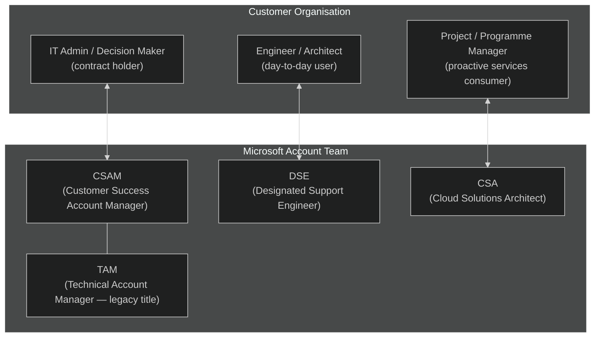
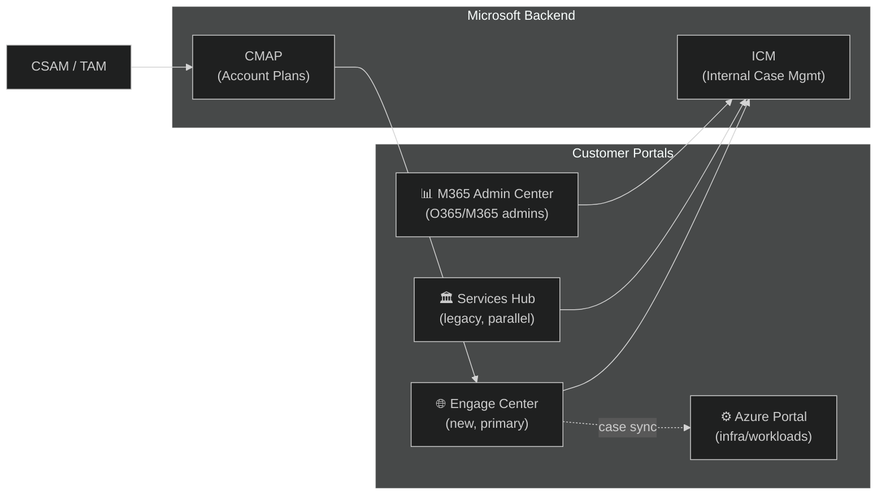
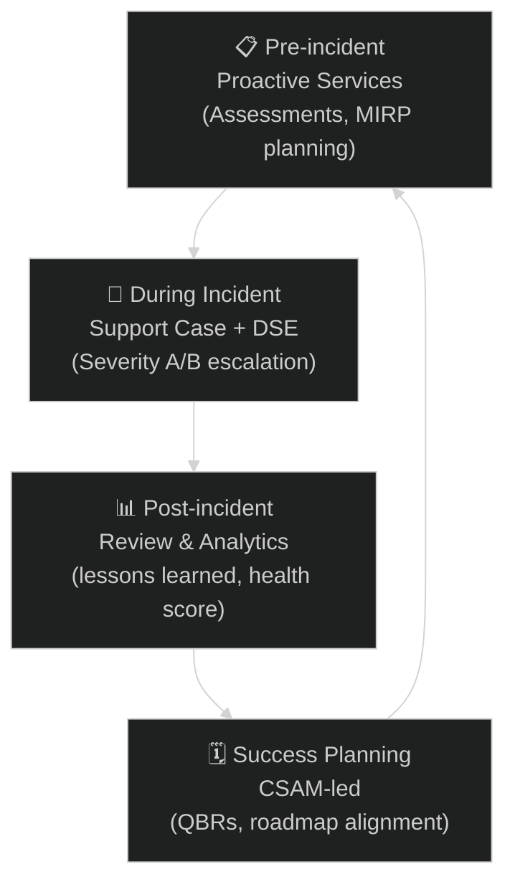

# 00 — Engage Center: Platform Overview
{: .no_toc }

> 📁 [← Back to Home](/engage-center-notes/)

  
Table of contents

  {: .text-delta }
1. TOC
{:toc}

---

## What Is Engage Center?

**Microsoft Engage Center** (`engagecenter.microsoft.com`) is the next-generation customer experience portal for organisations with a **Microsoft Unified Support** agreement (and, progressively, select Premier customers). It is designed as the single, modernised destination for:

- Filing and tracking **support cases**
- Accessing **proactive services** (On-Demand Assessments, health checks, MIRP)
- Managing **contacts and account teams** (CSAMs, TAMs, DSEs)
- Consuming **learning paths** and Microsoft-curated content
- Viewing **analytics** on support consumption and service health

> **Key distinction:** Engage Center is not a new support *contract* — it is a new *portal experience* layered on top of existing Unified Support entitlements.

---

## Context & Rollout

Engage Center is part of Microsoft's broader initiative to modernise customer touchpoints following the **Unified Support rebrand** (which replaced Premier Support). Key milestones:

| Milestone | Detail |
|-----------|--------|
| **Premier → Unified transition** | New Premier contracts ceased; Microsoft Unified (Unified Enterprise Plan) launched |
| **Services Hub** | Web portal introduced as the primary interface for Unified customers |
| **Engage Center GA** | Rolling out from 2024–2025; progressively replacing Services Hub for most workflows |
| **Parallel operation** | Both portals remain active during transition; certain features still only in Services Hub |
| **Full migration** | No firm date published by Microsoft — both portals remain active; check with your CSAM for your organisation's status |

> ⚠️ The rollout is phased. Not all features are available to all customers simultaneously. Check your account team for your organisation's migration timeline.

---

## Key Personas

Understanding who uses Engage Center helps you navigate the platform effectively.

| Persona | Role | Primary Engage Center Activity |
|---------|------|-------------------------------|
| **IT Admin** | Contract & licence management | Account settings, contacts, contract details |
| **Engineer / Architect** | Hands-on workload owner | Support cases, On-Demand Assessments, learning |
| **CSAM** | Relationship + success planning | Account health, proactive service scheduling |
| **DSE** | Deep technical escalation | Case collaboration, advisory |
| **CSA** | Solution architecture guidance | Assessment reviews, MIRP, technical advisory |

---

## Platform Positioning

Engage Center sits at the intersection of **reactive support** (cases) and **proactive success** (services, learning), acting as the primary lens through which customers consume their Unified Support investment.

---

## How Engage Center Fits the Support Lifecycle

The platform is designed to support **all four phases** of the support lifecycle, not just reactive case management.

---

## Access & Authentication

| Requirement | Detail |
|-------------|--------|
| **Who can access** | Users associated with an active Unified Support contract |
| **Authentication** | Microsoft Entra ID (Azure AD) — organisational account required |
| **Admin provisioning** | Your IT Admin or CSAM must associate your account |
| **MFA** | Required (Microsoft Entra Conditional Access policies apply) |
| **Supported browsers** | Edge, Chrome, Firefox (latest versions); Safari supported |

> 💡 If you cannot access `engagecenter.microsoft.com`, contact your CSAM or raise a request through `support.microsoft.com` to get your account provisioned.

---

## Key Terminology

| Term | Definition |
|------|-----------|
| **Unified Support** | Microsoft's current support contract model (replaced Premier) — officially branded **Microsoft Unified** / Unified Enterprise Plan; entitlements defined per individual agreement |
| **Premier Support** | Legacy contract model, still active for existing customers but no longer sold as new |
| **CSAM** | Customer Success Account Manager — your primary Microsoft relationship contact |
| **DSE** | Designated Support Engineer — deep technical resource assigned under some contracts |
| **On-Demand Assessment** | Automated or guided technical health check (formerly called "Rapid Assessment Proactive Service") |
| **MIRP** | Microsoft Incident Response Planning — proactive service for IR readiness |
| **Proactive Service** | Any Microsoft-delivered service consumed from contract hours (not a break-fix case) |
| **Severity / Priority** | Case urgency level (A = business-critical, B = significant, C = general) |
| **ICM** | Internal Microsoft case management system — what CSAMs and DSEs use behind the scenes |

---

## What's Next?

- 🧭 [01 — Navigation & Features](/engage-center-notes/01-navigation-features/) — UI walkthrough, how to find everything
- 📄 [03 — Unified & Premier Contracts](/engage-center-notes/03-unified-premier-contracts/) — understand your entitlements
- 🔄 [05 — Services Hub vs Engage Center](/engage-center-notes/05-services-hub-comparison/) — what moved, what hasn't

---

[← Back to Home](/engage-center-notes/) | [01 — Navigation & Features →](/engage-center-notes/01-navigation-features/)
