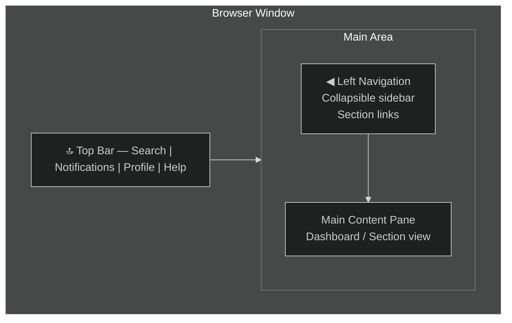
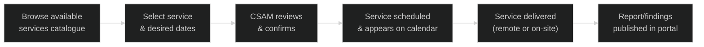

# 01 — Navigation & Features
{: .no_toc }

> 📁 [← Back to Home](/engage-center-notes/)

  
Table of contents

  {: .text-delta }
1. TOC
{:toc}

---

## Portal Layout Overview

Engage Center follows a **left-nav + main content** layout, consistent with other Microsoft portals (Azure Portal, M365 Admin Center).

### Top Bar

| Element | Function |
|---------|----------|
| **Search bar** | Global full-text search across cases, services, learning, and contacts |
| **Notifications bell** | Alerts for case updates, scheduled services, and system messages |
| **Profile/account** | Switch tenant, view profile, sign out |
| **Help (?)** | Contextual documentation, support for the portal itself |
| **Microsoft logo** | Returns to Home dashboard |

---

## Left Navigation Sections

The primary left-nav sections (as of 2025 GA rollout):

| Section | Icon | What You Do Here |
|---------|------|-----------------|
| **Home** | 🏠 | Dashboard — activity feed, quick links, health highlights |
| **Support** | 🎫 | Create and manage support requests (cases) |
| **Services** | 📋 | Proactive services — schedule, view, consume assessments and advisory |
| **Learning** | 🎓 | Microsoft-curated learning paths, events, and content |
| **People & Contacts** | 👤 | Account team contacts (CSAM, DSE, TAM), manage your org's users |
| **Account** | 🏢 | Contract details, entitlements summary, organisation info |
| **Analytics** | 📊 | Reports on support consumption, service health, case trends |
| **Settings** | ⚙️ | Notification preferences, portal personalisation |

> 💡 The left nav can be collapsed to icon-only mode — useful on smaller screens or when you want maximum content width.

---

## Home Dashboard

The **Home** dashboard is your entry point after login. It is personalised based on your role and recent activity.

### Dashboard Widgets

| Widget | Content |
|--------|---------|
| **Active Support Requests** | Open cases with status indicators |
| **Upcoming Services** | Scheduled proactive services (assessments, reviews) |
| **Recent Activity** | Latest updates across cases and services |
| **Quick Actions** | One-click shortcuts: New Case, Request Service, etc. |
| **Service Health** | Azure / M365 health status summary (linked to Azure Status) |
| **Learning Highlights** | Recommended content based on your workloads |

---

## Support Section

The Support section is where you manage reactive break-fix cases. See [02 — Support Requests](/engage-center-notes/02-support-requests/) for full detail.

**Key views:**
- **All Requests** — filterable list of all open and closed cases
- **My Requests** — cases you personally created or are watching
- **Create New** — guided case creation wizard
- **Escalations** — cases flagged for management attention

---

## Services Section

The Services section exposes **proactive services** included with your Unified Support contract.

### Service Types Available

| Service Type | Description |
|-------------|-------------|
| **On-Demand Assessments** | Automated or guided health checks (Azure Well-Architected, Security, Identity, etc.) |
| **Advisory Services** | Scheduled technical advisory sessions with a DSE or CSA |
| **Workshops & Briefings** | Microsoft-delivered education sessions |
| **MIRP** | Microsoft Incident Response Planning — see [04 — Digital MIRP](/engage-center-notes/04-digital-mirp/) |
| **Rapid Response** | Accelerated resolution for critical proactive engagements |
| **Custom Engagements** | Contract-specific services negotiated with your CSAM |

### Consuming a Service

> ⚠️ Service availability depends on your contract tier and remaining hours. Your CSAM can advise on entitlements.

---

## Learning Section

The Learning section provides:

| Feature | Detail |
|---------|--------|
| **Learning Paths** | Curated, role-based learning sequences |
| **Microsoft Learn integration** | Deep links to Microsoft Learn modules |
| **Events** | Upcoming Microsoft webinars, workshops, and conferences |
| **Content Library** | Whitepapers, best practices guides, and reference architectures |
| **Personalised Recommendations** | Based on your workloads, role, and past activity |

---

## People & Contacts

Manage your relationship with your Microsoft account team and your organisation's users.

| Contact Type | Role | How to Reach |
|-------------|------|-------------|
| **CSAM** | Primary relationship manager, success planning | Shown in portal; email / Teams |
| **DSE** | Deep technical resource for escalations | Assigned per contract tier |
| **CSA** | Cloud architecture advisory | Engaged through proactive services |
| **Premier Field Engineer (PFE)** | Legacy title (some still active) | As per existing contract |
| **Account Executive / AE** | Commercial relationship | Not in Engage Center directly |

> 💡 Use the **People** section to confirm who your current CSAM is if your account team has changed. Account team rotations are common.

---

## Analytics & Reporting

The Analytics section provides visibility into your support consumption and service health.

### Available Reports

| Report | What It Shows |
|--------|--------------|
| **Case Volume Trend** | Number of support cases over time, by severity |
| **Resolution Time** | Average time to resolution by severity and product |
| **Service Consumption** | Hours consumed vs entitlement, by service type |
| **Top Issue Areas** | Most common product/workload areas for your org |
| **Health Score** | Microsoft-computed environment health indicator |
| **CSA Activity** | Advisory and proactive service engagement summary |

> 💡 Export to CSV or PDF is available for most reports — useful for internal reporting or QBR preparation.

---

## Search

The global search bar supports:

- **Case numbers** — direct lookup (`SR123456789`)
- **Keywords** — searches across case titles, service names, and learning content
- **Contact names** — find team members or Microsoft contacts
- **Knowledge Base** — Microsoft support KB articles relevant to your search

### Search Tips

| Tip | Example |
|-----|---------|
| Use case reference numbers for direct lookup | `SR123456789` or `119123456789` |
| Quote phrases for exact match | `"Azure Kubernetes"` |
| Filter by section | Use the filter pill after searching |

---

## Notifications & Alerts

Configure notifications in **Settings → Notifications**:

| Notification Type | Channel | Configurable? |
|------------------|---------|--------------|
| Case status update | Email + in-portal | Yes |
| New case comment | Email + in-portal | Yes |
| Scheduled service reminder | Email + in-portal | Yes |
| Contract expiry warning | Email | Yes |
| Service health alert | In-portal | Yes (linked to Azure subscription) |

---

## Account Settings

Navigate to **Settings** (gear icon) or your **profile avatar** → Settings:

| Setting | Detail |
|---------|--------|
| **Notification preferences** | Control per-event email/in-portal alerts |
| **Preferred language** | Portal UI language |
| **Time zone** | Affects case and service timestamps |
| **MFA / security** | Managed via Entra ID — redirects to AAD portal |
| **Organisation profile** | Managed by IT Admin — read-only for standard users |

---

## Productivity Tips for CSAs

| Tip | How |
|-----|-----|
| **Bookmark frequently used sections** | Browser bookmarks for `/support`, `/services`, `/analytics` |
| **Use search for fast case lookup** | Faster than navigating to Support → All Requests |
| **Pin the home dashboard widgets** | Customise order and which widgets are visible |
| **Export analytics before QBRs** | Pull 90-day case and service reports for prep |
| **Check People section after account team changes** | Confirm new CSAM details quickly |
| **Services catalogue as a conversation starter** | Use it with customers to show what's available under their contract |

---

## Known Limitations (as of 2025)

| Limitation | Notes |
|-----------|-------|
| **Not all Services Hub features migrated** | Some proactive service types still require Services Hub |
| **Bulk case management limited** | Mass-update / bulk close not yet available |
| **API access** | No public API yet for programmatic case creation (unlike Azure support API) |
| **Mobile app** | No dedicated mobile app; responsive web only |
| **Legacy case history** | Cases from before migration may have limited data in Engage Center |

> These limitations are expected to be resolved as the platform matures. Check the [Microsoft roadmap](https://learn.microsoft.com/en-us/microsoft-365/admin/misc/engage-center) for updates.

---

[← 00 — Platform Overview](/engage-center-notes/00-overview/) | [02 — Support Requests →](/engage-center-notes/02-support-requests/)
