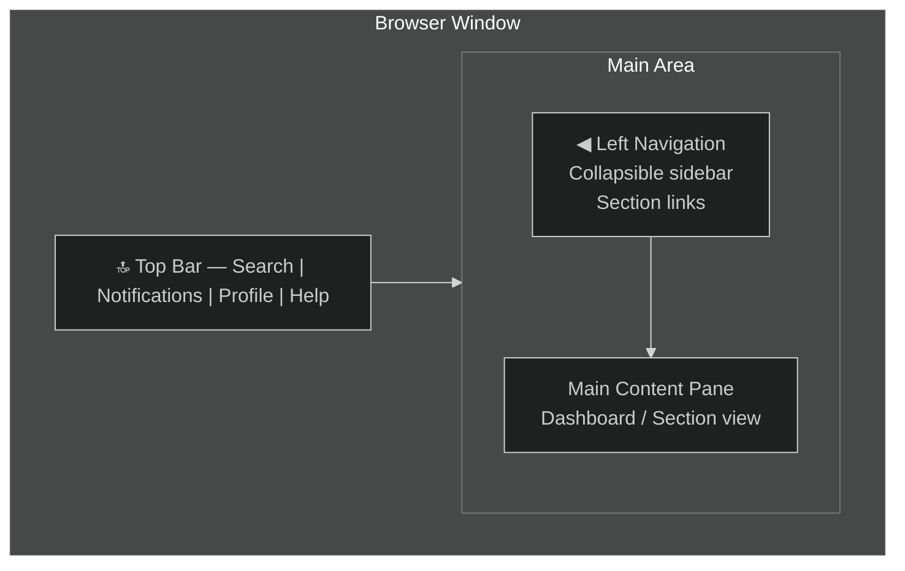

# 01 — Navigation & Features
{: .no_toc }

> 📁 [← Back to Home](/engage-center-notes/)

  
Table of contents

  {: .text-delta }
1. TOC
{:toc}

---

## Portal Layout Overview

Engage Center follows a **left-nav + main content** layout, consistent with other Microsoft portals (Azure Portal, M365 Admin Center).

### Top Bar

| Element | Function |
|---------|----------|
| **Search bar** | Global full-text search across cases, services, learning, and contacts |
| **Notifications bell** | Alerts for case updates, scheduled services, and system messages |
| **Profile/account** | Switch tenant, view profile, sign out |
| **Help (?)** | Contextual documentation, support for the portal itself |
| **Microsoft logo** | Returns to Home dashboard |

---

## Left Navigation Sections

The primary left-nav sections (current GA rollout):

| Section | Icon | What You Do Here |
|---------|------|-----------------|
| **Home** | 🏠 | Dashboard — activity feed, quick links, recent activity |
| **Support** | 🎫 | Create and manage support requests (cases) |
| **Support Insights** | 📊 | Analytics and reporting on support consumption and case trends |
| **Shared Files** | 📁 | Securely access and download files shared by your account team |
| **Customer Activity** | 📄 | Contract details, entitlement consumption, purchased services |
| **Major Incident Response Plan** | 🛡️ | MIRP — workload inventory, contacts, response guidelines, Azure Health |
| **Learning** | 🎓 | On-demand learning, instructor-led sessions, and learning management |
| **On-Demand Assessments** | 🔍 | Run automated health assessments across your Microsoft environments |
| **User Management** | 👤 | User roles and Microsoft Entra group assignments |
| **Settings** | ⚙️ | Notification preferences, portal features, personalisation |
| **External Resources** | 🔗 | Manage links and access to external tenants and resources |

> ⚠️ Navigation availability varies by rollout phase and customer workspace type. Features transition progressively from Services Hub — not all sections may be visible until your workspace is fully migrated. See [05 — Services Hub vs Engage Center](/engage-center-notes/05-services-hub-comparison/) for the rollout phase order.

> 💡 The left nav can be collapsed to icon-only mode — useful on smaller screens or when you want maximum content width.

---

## Home Dashboard

The **Home** dashboard is your entry point after login. It is personalised based on your role and recent activity.

### Dashboard Widgets

| Widget | Content |
|--------|---------|
| **Active Support Requests** | Open cases with status indicators |
| **Upcoming Services** | Upcoming scheduled learning sessions and services |
| **Recent Activity** | Latest updates across cases and services |
| **Quick Actions** | One-click shortcuts: New Case, Request Service, etc. |
| **Service Health** | Azure / M365 health status summary (linked to Azure Status) |
| **Learning Highlights** | Recommended content based on your workloads |

---

## Support Section

The Support section is where you manage reactive break-fix cases. See [02 — Support Requests](/engage-center-notes/02-support-requests/) for full detail.

**Key views:**
- **All Requests** — filterable list of all open and closed cases
- **My Requests** — cases you personally created or are watching
- **Help + Support** — case creation entry point (two experiences available: Enhanced self-help form, or Support AI Assistant)
- **Escalations** — cases flagged for management attention

> 💡 Only users with the **Support User** role can create support cases. Administrators alone cannot open cases without also having the Support User role assigned.

---

## Major Incident Response Plan

The **Major Incident Response Plan (MIRP)** is a self-service portal tool with its own dedicated section in the left nav. It is not a consulting engagement — it is a digital tool for maintaining shared readiness between your organisation and Microsoft. See [04 — Digital MIRP](/engage-center-notes/04-digital-mirp/) for full detail.

| Sub-section | What It Contains |
|-------------|-----------------|
| **Cloud Solutions** | Inventory of business-critical Azure, M365, D365, and Power Platform workloads + key contacts; attestation |
| **Your Account Team** | Microsoft contact info and support portal links — maintained by Microsoft |
| **Response Guidelines** | Before / During / After incident guidance; searchable by topic |
| **Azure Health** | Services Dashboard (subscription health alerts) and Resiliency Recommendations (links to Azure Advisor) |

> 💡 MIRP must be enabled in **Settings → Features** before it appears in the left nav. For organisations with multiple workspaces, it can be toggled per workspace or enabled across all via the rollup workspace. Note: customers with a **single workspace** cannot toggle MIRP off once enabled.

> 💡 Managing contacts within MIRP requires the **Mirp Manager** role. The **Mirp Viewer** role can create and edit solutions and toggle tenants, but cannot add contacts or attest the plan.

---

## Incident Readiness

The **Incident Readiness** section (under the Health area) provides guidance on preparing for and responding to the three types of cloud incidents Microsoft categorises:

| Incident Type | Description |
|--------------|-------------|
| **Service incidents** | Unplanned downtime, outages, performance degradation affecting Microsoft services |
| **Privacy incidents** | Potential unauthorised use or disclosure of customer data |
| **Security incidents** | Confirmed breaches resulting in data destruction, loss, or unauthorised access |

The section covers product-specific readiness guidance:
- **Azure Incident Readiness** — preparation steps and response actions for Azure workloads
- **Microsoft 365, Dynamics 365 & Power Platform Incident Readiness** — equivalent guidance for those product families

> 💡 Incident Readiness complements MIRP: MIRP maintains your workload inventory and contacts; Incident Readiness provides the product-specific guidance on what to do when an incident occurs.

---

## External Resources

The **External Resources** section allows you to manage links and access to external tenants and resources within your Engage Center workspace. This is also where tenant visibility for MIRP (Cloud Solutions) is controlled — tenants can be toggled on or off for each workspace.

> 💡 If a tenant is missing from the MIRP Cloud Solutions dropdown, check External Resources first. See [aka.ms/ec-externalresources](https://aka.ms/ec-externalresources) for the management guide.

---

## Shared Files

The **Shared Files** section provides a centralised location to securely access support-related files shared by your CSAM or Incident Manager. From here you can download files to your local device or delete them (if permitted by your role).

| Action | Who Can Do It |
|--------|--------------|
| **View & download files** | Users with the Shared Files role |
| **Delete files** | Users with the Shared Files role (with delete permission) |
| **Upload files** | CSAMs and Incident Managers only — not available to customers |

> 💡 If you cannot see Shared Files in the nav, confirm you have been assigned the **Shared Files role** by your Customer Support Manager or Administrator.

---

## Proactive Services

> 💡 **Two distinct types of "services" exist in Engage Center — they are separate:**
> - **Learning → Scheduled Services**: instructor-led learning sessions and workshops that you can browse and register for directly within the Learning section (see below)
> - **Consulting / advisory proactive services**: advisory sessions, custom engagements, and similar contract-based services are coordinated through your **CSAM**, not via a self-service catalogue

**On-Demand Assessments** have their own dedicated section in the left nav (see above). They use the Engage Center Connector and Azure Log Analytics — initial setup requires an Azure subscription and Log Analytics workspace (~2 hours to configure). Requires the **Assessment User** role.

Advisory sessions, workshops, and custom consulting engagements are drawn from your contract's annual hours pool and scheduled in coordination with your CSAM. Availability and scope depend on your agreement.

> 💡 To understand what consulting services are available under your agreement, check entitlement hours in **Customer Activity** and confirm scope with your CSAM.

---

## Learning Section

The Learning section brings together discovery, participation, and progress tracking in a single location. It is organised into four main sub-sections:

| Sub-section | What It Provides |
|-------------|-----------------|
| **All Titles** | Browse all available learning and service offerings — on-demand and scheduled; filter by product or keyword |
| **On-Demand Learning** | Self-paced Microsoft Learn modules, learning paths, and interactive hands-on labs; progress is automatically tracked |
| **Scheduled Services** | Instructor-led sessions and guided workshops; browse descriptions, timing, and formats; navigate to registration for upcoming sessions |
| **My Learning** | Personalised view of your learning journey — Not Started / In Progress / Completed; shows assigned learning and lets you resume where you left off |

> 💡 **Learning Management** (assigning learning to team members, setting due dates, tracking completion) requires the **Learning Manager** role. General access to learn requires the **Learning User** role.

> ⚠️ **Scheduled Services** (under Learning) = instructor-led learning sessions. This is distinct from consulting/advisory proactive services, which are coordinated through your CSAM. See the Proactive Services section above.

---

## Account Team Contacts

Microsoft account team contact details are accessible within **Major Incident Response Plan → Your Account Team**. This section is maintained by Microsoft and always contains current support contact information and portal links.

| Contact Type | Role | Where to Find |
|-------------|------|--------------|
| **CSAM** | Primary relationship manager, success planning | MIRP → Your Account Team; also via email / Teams |
| **DSE** | Deep technical resource for complex issues | Availability defined per agreement |
| **CSA** | Cloud architecture advisory | Engaged through proactive services via CSAM |
| **Premier Field Engineer (PFE)** | Legacy title (some still active) | As per existing Premier contract |
| **Account Executive / AE** | Commercial relationship | Not directly in Engage Center |

User and role management is handled through **User Management**, not through a People & Contacts section.

> 💡 If your account team has changed and contact details appear stale, ask your CSAM to update the Your Account Team section in MIRP.

---

## Support Insights

The **Support Insights** section provides data-driven analytics on the health and performance of Microsoft support for your organisation. It displays up to **18 months** of data across all cloud products.

| Metric / Report | What It Shows |
|----------------|--------------|
| **Total case count** | Total number of support requests |
| **Open case count** | Number of currently active support requests |
| **Average aging (days)** | Average age of open support requests |
| **IR Met %** | Percentage of cases where the initial response SLA was met |
| **Total CritSits** | Number of cases with a maximum severity of Severity A |
| **Crit Elapsed Minutes** | Minutes reactive support requests spent in Severity A status while open |
| **Avg CPT (hours)** | Average CPT (hours) trend for the past 18 months |
| **Case Volume Trend** | Support case volume trend by month (Open, Incoming, Resolved) |
| **Open cases by severity & age** | Age of open cases broken down by severity |
| **Open case by status** | All open support requests by current status |
| **Case count by Azure product** | Total number of cases by Azure product area |
| **Overall case distribution** | Technical vs. billing case split |

> 💡 Export to CSV or PDF is available for most reports — useful for internal reporting or QBR preparation. Access requires the **Reporting User** role (or **Problem Manager** role, which also includes case detail access).

---

## Search

The global search bar supports:

- **Case numbers** — direct lookup (`SR123456789`)
- **Keywords** — searches across case titles, service names, and learning content
- **Contact names** — find team members or Microsoft contacts
- **Knowledge Base** — Microsoft support KB articles relevant to your search

### Search Tips

| Tip | Example |
|-----|---------|
| Use case reference numbers for direct lookup | `SR123456789` or `119123456789` |
| Quote phrases for exact match | `"Azure Kubernetes"` |
| Filter by section | Use the filter pill after searching |

---

## Notifications & Alerts

Configure notifications in **Settings → Notifications**:

| Notification Type | Channel | Configurable? |
|------------------|---------|--------------|
| Case status update | Email + in-portal | Yes |
| New case comment | Email + in-portal | Yes |
| Scheduled service reminder | Email + in-portal | Yes |
| Contract expiry warning | Email | Yes |
| Service health alert | In-portal | Yes (linked to Azure subscription) |

---

## Account Settings

Navigate to **Settings** (gear icon) or your **profile avatar** → Settings:

| Setting | Detail |
|---------|--------|
| **Notification preferences** | Control per-event email/in-portal alerts |
| **Preferred language** | Portal UI language |
| **Time zone** | Affects case and service timestamps |
| **MFA / security** | Managed via Entra ID — redirects to AAD portal |
| **Organisation profile** | Managed by IT Admin — read-only for standard users |

---

## Productivity Tips for CSAs

| Tip | How |
|-----|-----|
| **Bookmark frequently used sections** | Browser bookmarks for Support, Support Insights, Customer Activity, and MIRP |
| **Use search for fast case lookup** | Faster than navigating to Support → All Requests |
| **Pin the home dashboard widgets** | Customise order and which widgets are visible |
| **Export Support Insights before QBRs** | Pull 90-day case reports from Support Insights |
| **Check MIRP → Your Account Team after account team changes** | Always reflects current CSAM and Microsoft contact details |
| **Customer Activity as a conversation starter** | Use it with customers to show entitlement consumption, hours remaining, and purchased services |

---

## Known Limitations (as of 2025)

| Limitation | Notes |
|-----------|-------|
| **Not all Services Hub features migrated** | Some proactive service types still require Services Hub |
| **Bulk case management limited** | Mass-update / bulk close not yet available |
| **API access** | No public API yet for programmatic case creation (unlike Azure support API) |
| **Mobile app** | No dedicated mobile app; responsive web only |
| **Legacy case history** | Cases from before migration may have limited data in Engage Center |

> These limitations are expected to be resolved as the platform matures. Check the [Microsoft roadmap](https://learn.microsoft.com/en-us/services-hub/) for updates.

---

[← 00 — Platform Overview](/engage-center-notes/00-overview/) | [02 — Support Requests →](/engage-center-notes/02-support-requests/)
