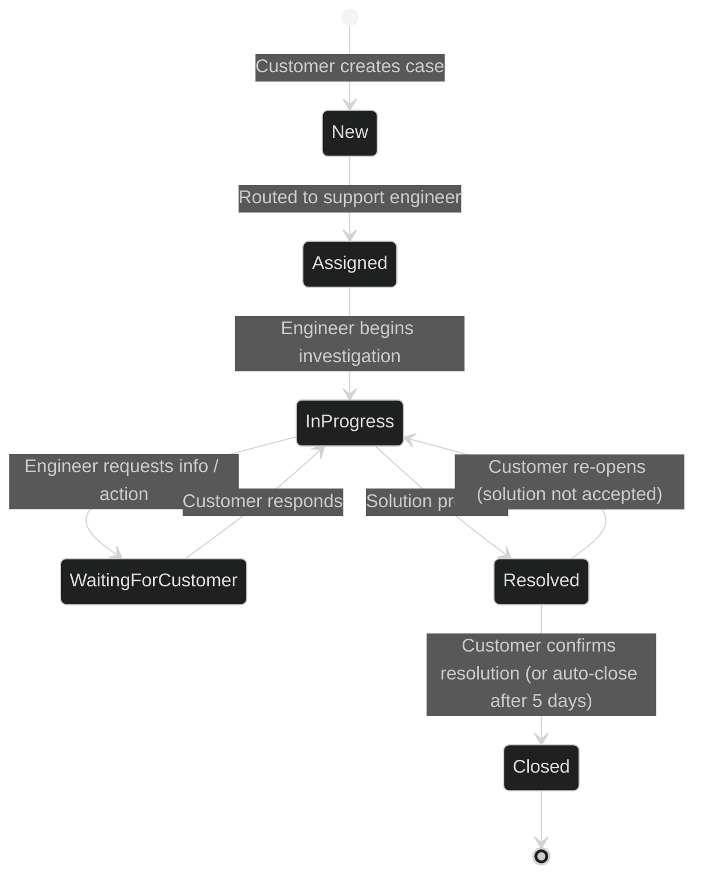
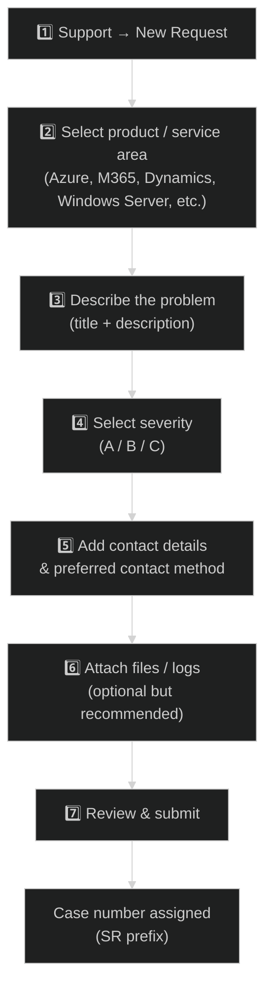
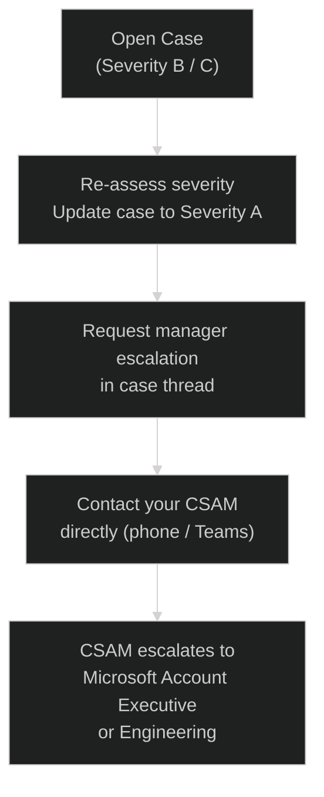

# 02 — Support Requests
{: .no_toc }

> 📁 [← Back to Home](/engage-center-notes/)

  
Table of contents

  {: .text-delta }
1. TOC
{:toc}

---

## Overview

The **Support** section of Engage Center is the primary interface for creating and managing break-fix support cases (also called **Support Requests / SRs**). Cases raised here are routed into Microsoft's internal ICM system and assigned to the appropriate support team.

> 💡 Engage Center support cases are the same underlying cases you would have raised through Services Hub or the Azure Portal — the portal is a different front-end to the same support organisation.

---

## Severity Levels

Microsoft uses severity (also called **priority** in some product areas) to determine initial response time:

| Severity | Business Impact | Initial Response Target |
|----------|----------------|------------------------|
| **Severity A / Critical** | Complete business outage or critical production system down; no workaround | **≤ 1 hour** (Unified Advanced/Performance) |
| **Severity B / High** | Significant feature loss, major performance degradation; partial workaround possible | **≤ 2 hours** (Unified Advanced/Performance) |
| **Severity C / General** | Minor impact, question, or general guidance request | **≤ 4 business hours** |

> ⚠️ Initial response time SLAs apply to **Unified Advanced** and **Unified Performance** contracts. **Unified Core** receives next-business-day response for Severity A/B. See [03 — Unified & Premier Contracts](/engage-center-notes/03-unified-premier-contracts/) for full tier comparison.

---

## Case Lifecycle

### Case States

| State | Meaning |
|-------|---------|
| **New** | Case submitted; not yet assigned to an engineer |
| **Assigned** | Engineer allocated; initial review in progress |
| **In Progress** | Active investigation underway |
| **Waiting for Customer** | Microsoft is waiting for information, logs, or confirmation from you |
| **Resolved** | Microsoft has provided a solution or workaround |
| **Closed** | Case concluded — either confirmed resolved or auto-closed |

> ⚠️ Cases in **Waiting for Customer** status **do not count against Microsoft's SLA clock**. Respond promptly to avoid delays.

---

## Creating a New Support Request

### Step-by-Step

### Tips for a Strong Case Description

| Element | Best Practice |
|---------|--------------|
| **Title** | Be specific: "Azure VM cannot RDP after NSG change" not "VM issue" |
| **Problem statement** | What is happening vs what is expected |
| **Impact** | How many users/systems affected, business consequence |
| **Steps to reproduce** | Numbered steps that reliably trigger the issue |
| **Recent changes** | Any deployments, config changes, updates in the 48h before the issue |
| **Error messages** | Exact text + any error codes |
| **Resource IDs** | Azure subscription ID, resource group, resource name |
| **Logs** | Attach relevant logs upfront — speeds diagnosis significantly |

---

## Attachments & Collaboration

| Feature | Detail |
|---------|--------|
| **File attachments** | Upload logs, screenshots, config exports (max file size varies by type) |
| **Case thread** | Threaded conversation visible to all watchers |
| **Watchers** | Add colleagues to receive updates without them owning the case |
| **Internal notes** | Not available to end users — engineers use this for internal tracking |
| **Screen sharing** | Engineers may request a screen share session through Teams or Remote Desktop |

---

## Escalation

If resolution is unsatisfactory or urgency has increased:

### Escalation Paths

| Escalation Option | When to Use |
|------------------|-------------|
| **Update severity** | Impact has increased since case was filed |
| **Manager escalation request** | Engineer responsiveness inadequate for the business impact |
| **Contact CSAM** | Most effective for Severity A — your CSAM can directly accelerate |
| **Premier/Executive escalation** | Available under Unified Performance; CSAM coordinates |

> 💡 Always **update the case notes** when you escalate, documenting the business impact clearly. This creates a paper trail and helps the support engineer's manager prioritise.

---

## Case Management Best Practices

| Practice | Rationale |
|----------|-----------|
| **Respond within 24h to "Waiting for Customer"** | Avoids unintended auto-close and keeps the SLA clock fair |
| **Use watchers liberally** | Keeps managers and architects informed without creating duplicate cases |
| **Include subscription/tenant ID at case creation** | Prevents back-and-forth on basic account identification |
| **One issue per case** | Mixed-issue cases are harder to route and track; open separate SRs |
| **Reference prior cases** | If issue recurs, mention previous SR number — helps pattern recognition |
| **Close cases yourself** | Don't wait for auto-close; confirm resolution to keep analytics clean |

---

## Support for Specific Products

Different Microsoft product areas have slightly different case routing:

| Product Area | Routing Notes |
|-------------|--------------|
| **Azure (IaaS/PaaS)** | Routed by resource type; subscription ID required |
| **Microsoft 365 / Exchange / Teams** | Tenant ID required; often handled by M365 support team |
| **Dynamics 365** | Separate support track; environment ID required |
| **Windows Server / SQL Server on-premises** | Routes to Premier/Unified on-premises support team |
| **Security (Defender, Sentinel)** | May route to MSRC for vulnerability reports; otherwise standard |
| **Azure DevOps** | Organisation URL required |

---

## Case Numbers & Reference Formats

| Format | Product Area |
|--------|-------------|
| `SR123456789` | Standard Unified Support case reference |
| `119123456789` | Older Premier/ICM format (still common in email threads) |
| `CRM:xxxxxxxxx` | Internal Microsoft CRM reference (seen in automated emails) |

> 💡 Always reference the `SR` number when contacting your CSAM or following up by email — it is the most reliable cross-system identifier.

---

## SLA Reference Table

| Contract Tier | Severity A Initial Response | Severity B Initial Response | Severity C Initial Response |
|--------------|----------------------------|-----------------------------|------------------------------|
| **Unified Core** | Next business day | Next business day | Next business day |
| **Unified Advanced** | ≤ 1 hour (24/7) | ≤ 2 hours (24/7) | ≤ 4 business hours |
| **Unified Performance** | ≤ 1 hour (24/7) | ≤ 2 hours (24/7) | ≤ 4 business hours |
| **Legacy Premier** | ≤ 1 hour (24/7) | ≤ 2 hours (24/7) | ≤ 4 business hours |

> ⚠️ These are **initial response** targets, not resolution time targets. Resolution time varies by complexity and is not contractually guaranteed.

---

## Related

- 📄 [03 — Unified & Premier Contracts](/engage-center-notes/03-unified-premier-contracts/) — understand which SLA tier applies to your organisation
- 🔄 [05 — Services Hub vs Engage Center](/engage-center-notes/05-services-hub-comparison/) — case creation differences
- ⚡ [06 — Cheatsheet](/engage-center-notes/06-cheatsheet/) — quick severity/SLA reference

---

[← 01 — Navigation & Features](/engage-center-notes/01-navigation-features/) | [03 — Unified & Premier Contracts →](/engage-center-notes/03-unified-premier-contracts/)
