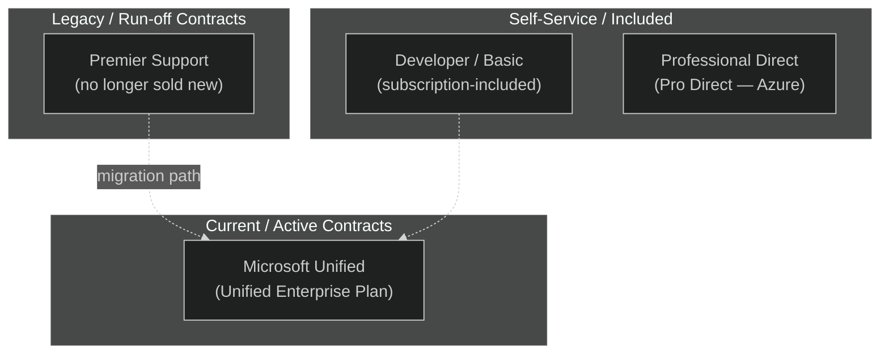
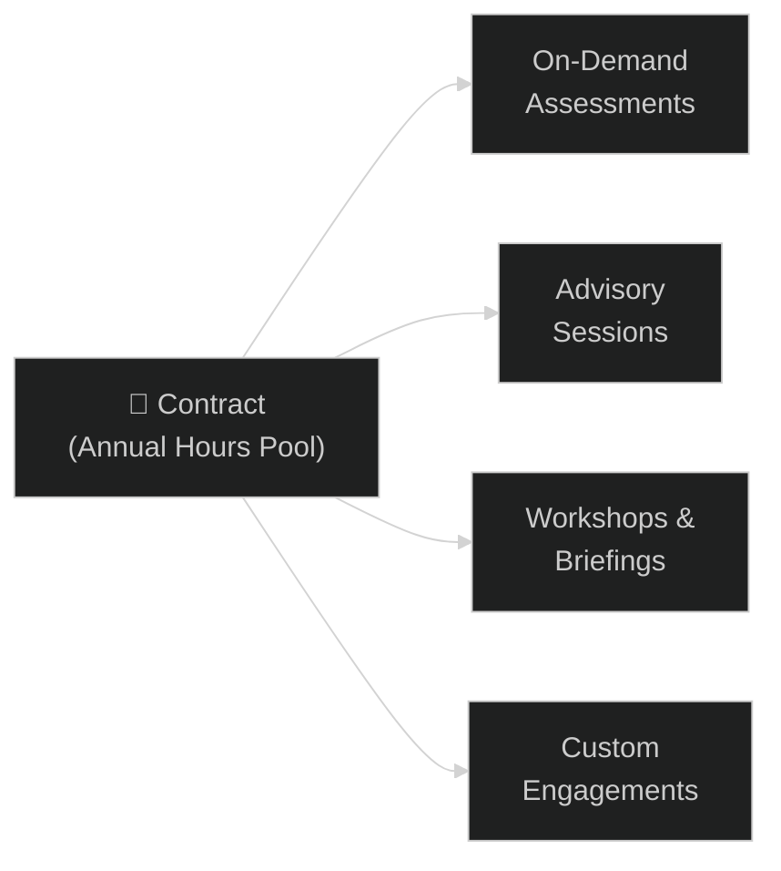

# 03 — Unified & Premier Contracts
{: .no_toc }

> 📁 [← Back to Home](/engage-center-notes/)

  
Table of contents

  {: .text-delta }
1. TOC
{:toc}

---

## Support Landscape Overview

Microsoft offers two broad support contract families to enterprise customers:

> ⚠️ **Premier Support is no longer sold** as a new contract. Existing Premier customers are being migrated to Unified Support. Some organisations retain legacy Premier terms until renewal.

---

## Microsoft Unified — Official Positioning

Microsoft's current enterprise support offering is marketed as **Microsoft Unified** (also referred to as the **Unified Enterprise Plan**). Based on current official documentation at [microsoft.com/microsoft-unified](https://www.microsoft.com/en-us/microsoft-unified):

| Attribute | Detail |
|-----------|--------|
| **Official brand name** | Microsoft Unified / Unified Enterprise Plan |
| **Service categories** | **Value Acceleration Services** (proactive, strategic) and **Mission Critical Services** (reactive break-fix, incident response) |
| **Entitlement model** | Individual negotiated contract — Microsoft does not publish a fixed tier breakdown publicly |
| **CSAM** | Included — named account manager for the customer relationship and success planning |
| **Portal** | Engage Center (`engagecenter.microsoft.com`) |
| **Predecessor** | Legacy Premier Support (no longer sold; migration to Unified at renewal) |

---

## Legacy Premier Support

Premier Support was Microsoft's previous flagship enterprise support contract. Key facts for CSAs:

| Attribute | Detail |
|-----------|--------|
| **Status** | No longer sold as new; existing contracts honoured until renewal/expiry |
| **Structure** | Annual contract with included Technical Account Manager (TAM) |
| **Cases** | Unlimited, 24/7, similar SLAs to Microsoft Unified |
| **Proactive services** | Premier Field Engineer (PFE) time for on-site/remote engagements |
| **Migration path** | Customers encouraged to migrate to Microsoft Unified at renewal |
| **Portal** | Services Hub (`serviceshub.microsoft.com`) — Engage Center access being extended |

### Premier vs Unified: Key Differences

| Dimension | Premier (Legacy) | Unified (Current) |
|-----------|:---------------:|:-----------------:|
| **Sold as new** | ❌ (discontinued) | ✅ |
| **TAM included** | ✅ (Technical Account Manager) | CSAM equivalent |
| **PFE hours** | ✅ (on-site capable) | DSE (primarily remote) |
| **Proactive services** | PFE-delivered workshops | Broader catalogue, On-Demand Assessments |
| **On-Demand Assessments** | Limited | ✅ (full catalogue) |
| **Portal** | Services Hub | Engage Center (+ Services Hub during transition) |
| **Contract flexibility** | Fixed annual | Negotiated per agreement |

> 💡 If you work with customers still on Premier, understand that their **TAM is functionally equivalent to a CSAM** and their **PFE hours map to proactive service hours**. Migration conversations should focus on continuity, not disruption.

---

## Proactive Services Entitlements

Proactive services are non-break-fix services consumed from an annual hours pool under your contract.

> 💡 **Digital MIRP** is a self-service portal tool built into Engage Center — it is not consumed from the proactive hours pool. See [04 — Digital MIRP](/engage-center-notes/04-digital-mirp/) for details.

| Service | Included in Microsoft Unified | Notes |
|---------|:-----------------------------:|-------|
| On-Demand Assessments | Contract-dependent | Availability and scope defined in your agreement |
| Advisory sessions | Contract-dependent | Drawn from the annual proactive hours pool |
| Workshops & Briefings | Contract-dependent | Drawn from the annual proactive hours pool |
| Custom engagements | Contract-dependent | Bespoke services available based on agreement |
| Digital MIRP (portal tool) | Role/contract dependent | Requires appropriate Engage Center role |

> 💡 Hours consumed by proactive services are tracked in the **Support Insights** section of Engage Center. Monitor consumption against your entitlement pool — unused hours do not roll over.

---

## Contract Administration in Engage Center

| Task | Where in Engage Center |
|------|----------------------|
| View contract & agreement details | **Customer Activity** |
| View purchased services & deliveries | **Customer Activity** |
| View entitlement hours remaining | **Customer Activity** |
| View Support Insights & case analytics | **Support Insights** |
| Add/remove user permissions | **User Management** (Entra group-based) |
| Manage Microsoft Entra groups | **User Management** |
| Request contract amendment | Contact your CSAM directly |
| View invoice history | Not in Engage Center — contact your Microsoft Account Executive |

> ⚠️ Navigation paths in Engage Center continue to evolve during the rollout. If a path has moved, refer to the [Engage Center documentation](https://learn.microsoft.com/en-us/services-hub/microsoft-engage-center/) or ask your CSAM.

---

## Common CSA Scenarios

### Scenario 1: Customer asks "What are we entitled to?"

> Navigate to **Customer Activity** in Engage Center. Show the proactive hours pool and which services are available. Microsoft does not publish a fixed public entitlement breakdown — the customer's signed contract and their CSAM are the authoritative sources. For services not visible in the catalogue, ask the CSAM to confirm what's included in the agreement.

### Scenario 2: Customer on Premier asks about migration to Unified

> Key points:
> - Response SLAs under Microsoft Unified are comparable to Premier — defined in the new agreement
> - On-Demand Assessments in Unified are a significant new capability not available in Premier
> - The portal experience improves (Engage Center > Services Hub)
> - PFE-style on-site delivery shifts to primarily remote DSE — flag this if the customer values on-site presence

### Scenario 3: Customer wants to understand their support response times

> Initial response targets are: **≤ 1 hour (24/7)** for Severity A, **≤ 2 hours (24/7)** for Severity B, and **≤ 4 business hours** for Severity C. For active incidents, the priority is opening the case at the correct severity in Engage Center — response time tracking starts from case creation. Proactive hours, named resources, and additional entitlements are defined per the customer's agreement.

---

## Official Resources

| Resource | Link |
|----------|------|
| Microsoft Unified overview | [microsoft.com/microsoft-unified](https://www.microsoft.com/en-us/microsoft-unified) |
| Services Hub — Unified Support docs | [learn.microsoft.com/services-hub/unified](https://learn.microsoft.com/en-us/services-hub/unified/) |
| Customer Activity (contract details) | [Services Hub Customer Activity](https://learn.microsoft.com/en-us/services-hub/unified/contracts/cap) |
| Engage Center overview | [Engage Center overview](https://learn.microsoft.com/en-us/services-hub/microsoft-engage-center/get-started/) |

---

## Related Content

- 🎫 [02 — Support Requests](/engage-center-notes/02-support-requests/) — SLA reference by severity
- 🛡️ [04 — Digital MIRP](/engage-center-notes/04-digital-mirp/) — portal tool for IR readiness
- ⚡ [06 — Cheatsheet](/engage-center-notes/06-cheatsheet/) — quick reference for URLs, SLAs, and CSA tips

---

[← 02 — Support Requests](/engage-center-notes/02-support-requests/) | [04 — Digital MIRP →](/engage-center-notes/04-digital-mirp/)
