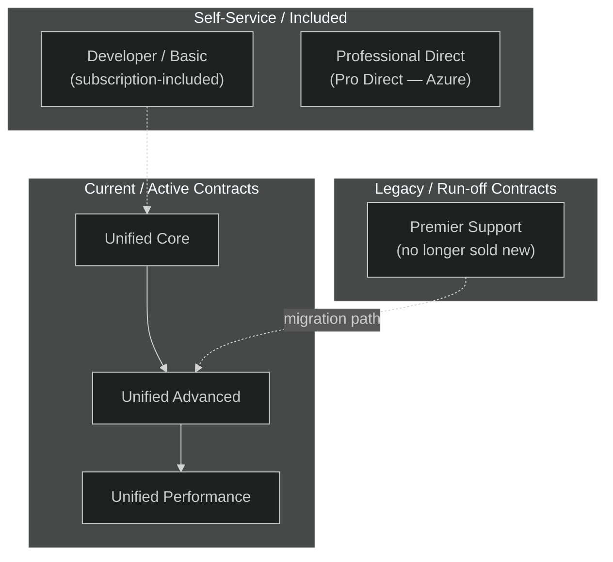
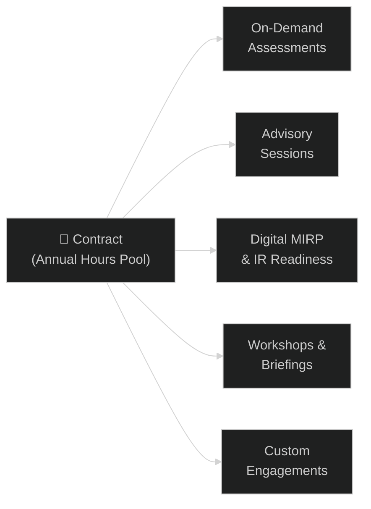

# 03 — Unified & Premier Contracts
{: .no_toc }

> 📁 [← Back to Home](/engage-center-notes/)

  
Table of contents

  {: .text-delta }
1. TOC
{:toc}

---

## Support Landscape Overview

Microsoft offers two broad support contract families to enterprise customers:

> ⚠️ **Premier Support is no longer sold** as a new contract. Existing Premier customers are being migrated to Unified Support. Some organisations retain legacy Premier terms until renewal.

---

## Unified Support Tiers

### Quick Comparison

| Feature | Unified Core | Unified Advanced | Unified Performance |
|---------|:-----------:|:---------------:|:------------------:|
| **24/7 break-fix support** | ✅ | ✅ | ✅ |
| **Severity A initial response** | Next business day | ≤ 1 hour | ≤ 1 hour |
| **Severity B initial response** | Next business day | ≤ 2 hours | ≤ 2 hours |
| **Severity C initial response** | Next business day | ≤ 4 business hours | ≤ 4 business hours |
| **Unlimited support cases** | ✅ | ✅ | ✅ |
| **CSAM** | Shared pool | Dedicated | Dedicated (senior) |
| **Designated Support Engineer (DSE)** | ❌ | Optional add-on | ✅ included |
| **On-Demand Assessments** | Limited | ✅ | ✅ (priority) |
| **Proactive service hours** | Limited | Included pool | Expanded pool |
| **Azure Advisor integration** | ✅ | ✅ | ✅ |
| **Executive escalation** | ❌ | ❌ | ✅ |
| **Engage Center access** | ✅ | ✅ | ✅ |
| **Typical customer profile** | SMB / Dev/Test | Mid-market | Large enterprise / regulated |

> ⚠️ Microsoft does not publish exact pricing publicly. Contract value is negotiated. The table above reflects *generally available feature differences* — your specific contract may vary.

---

## Unified Core

**Target:** Smaller organisations or those with lower Microsoft product dependency.

| Attribute | Detail |
|-----------|--------|
| **Cases** | Unlimited, all Microsoft products |
| **Response** | Business-hours SLA for all severities |
| **CSAM** | Shared / pool CSAM (may rotate) |
| **Proactive services** | Limited catalogue access |
| **Best for** | Organisations needing basic break-fix coverage across Microsoft products |

**Key limitation:** No 24/7 critical response SLA — Severity A cases submitted outside business hours are not guaranteed ≤1h response.

---

## Unified Advanced

**Target:** Mid-market and larger organisations with production Microsoft workloads.

| Attribute | Detail |
|-----------|--------|
| **Cases** | Unlimited, all products, 24/7 Severity A coverage |
| **Response** | ≤1h Sev A, ≤2h Sev B (24/7), ≤4h Sev C (business hours) |
| **CSAM** | Dedicated named CSAM |
| **Proactive hours** | Annual pool of hours for proactive services |
| **DSE** | Available as add-on |
| **Best for** | Enterprises running critical production workloads on Azure or M365 |

**CSA perspective:** This is the most common tier for enterprise customers. The dedicated CSAM relationship is the biggest differentiator from Core.

---

## Unified Performance

**Target:** Large enterprise, regulated industries, complex multi-cloud/hybrid environments.

| Attribute | Detail |
|-----------|--------|
| **Cases** | Unlimited, 24/7, with priority routing |
| **Response** | ≤1h Sev A, ≤2h Sev B (24/7) — same SLA as Advanced but with priority queueing |
| **CSAM** | Dedicated senior CSAM |
| **DSE** | Included in contract |
| **Proactive hours** | Larger annual pool; customisable service catalogue |
| **Executive escalation** | Available through CSAM to Microsoft Account Executive and Engineering |
| **Custom engagements** | Bespoke services, architecture reviews, joint roadmap sessions |
| **Best for** | Global enterprises, financial services, healthcare, government |

**CSA perspective:** Performance-tier customers often engage CSAs for extended architecture advisory. The DSE inclusion means you can plan deeper, ongoing technical engagements.

---

## Legacy Premier Support

Premier Support was Microsoft's previous flagship enterprise support contract. Key facts for CSAs:

| Attribute | Detail |
|-----------|--------|
| **Status** | No longer sold as new; existing contracts honoured until renewal/expiry |
| **Structure** | Annual contract with included Technical Account Manager (TAM) |
| **Cases** | Unlimited, 24/7, similar SLAs to Unified Advanced/Performance |
| **Proactive services** | Premier Field Engineer (PFE) time for on-site/remote engagements |
| **Migration path** | Customers encouraged to move to Unified Advanced or Performance at renewal |
| **Portal** | Services Hub (`serviceshub.microsoft.com`) — Engage Center access being extended |

### Premier vs Unified: Key Differences

| Dimension | Premier (Legacy) | Unified (Current) |
|-----------|:---------------:|:-----------------:|
| **Sold as new** | ❌ (discontinued) | ✅ |
| **TAM included** | ✅ (Technical Account Manager) | CSAM equivalent |
| **PFE hours** | ✅ (on-site capable) | DSE (primarily remote) |
| **Proactive services** | PFE-delivered workshops | Broader catalogue, On-Demand Assessments |
| **On-Demand Assessments** | Limited | ✅ (full catalogue) |
| **Portal** | Services Hub | Engage Center (+ Services Hub during transition) |
| **Contract flexibility** | Fixed annual | More tiered/modular |

> 💡 If you work with customers still on Premier, understand that their **TAM is functionally equivalent to a CSAM** and their **PFE hours map to proactive service hours**. Migration conversations should focus on continuity, not disruption.

---

## Proactive Services Entitlements

Proactive services are non-break-fix services consumed from an annual hours pool under your contract.

| Service | Core | Advanced | Performance |
|---------|:----:|:--------:|:-----------:|
| On-Demand Assessments | Limited | ✅ Full catalogue | ✅ Priority |
| Advisory sessions | ❌ | ✅ | ✅ Extended |
| Digital MIRP | ❌ | ✅ | ✅ |
| Workshops | Limited | ✅ | ✅ |
| Custom engagements | ❌ | Limited | ✅ |

> 💡 Hours consumed by proactive services are tracked in the Engage Center Analytics section. Monitor consumption against your entitlement pool — unused hours do not roll over.

---

## Contract Administration in Engage Center

| Task | Where in Engage Center |
|------|----------------------|
| View contract details | **Account → Contract** |
| View entitlement hours remaining | **Account → Entitlements** |
| See contract expiry date | **Account → Contract → Overview** |
| Add/remove contact permissions | **People & Contacts → Manage Users** |
| Request contract amendment | Contact your CSAM directly |
| View invoice history | Not in Engage Center — contact your Microsoft Account Executive |

---

## Common CSA Scenarios

### Scenario 1: Customer asks "What are we entitled to?"

> Navigate to **Account → Contract** in Engage Center. Show the proactive hours pool and which services are available. Cross-reference with the tier table above to explain what they're *not* getting and whether an upgrade makes sense.

### Scenario 2: Customer on Premier asks about migration to Unified

> Key points:
> - Response SLAs are comparable (Advanced or Performance match Premier)
> - On-Demand Assessments in Unified are a significant new capability not available in Premier
> - The portal experience improves (Engage Center > Services Hub)
> - PFE-style on-site delivery shifts to primarily remote DSE — flag this if the customer values on-site presence

### Scenario 3: Customer wants faster Severity A response than Core gives them

> Core does not provide ≤1h response. They need to upgrade to Advanced or Performance. Frame the business risk: a production outage with next-business-day response SLA on a Friday afternoon means Monday morning response.

---

## Related Content

- 🎫 [02 — Support Requests](/engage-center-notes/02-support-requests/) — SLA reference by severity
- 🛡️ [04 — Digital MIRP](/engage-center-notes/04-digital-mirp/) — proactive IR service (Advanced/Performance)
- ⚡ [06 — Cheatsheet](/engage-center-notes/06-cheatsheet/) — tier comparison at a glance

---

[← 02 — Support Requests](/engage-center-notes/02-support-requests/) | [04 — Digital MIRP →](/engage-center-notes/04-digital-mirp/)
