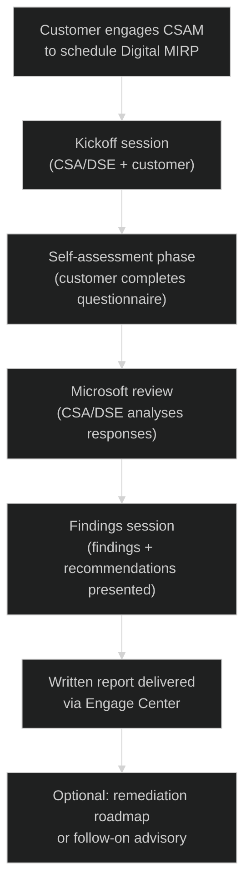

# 04 — Digital MIRP
{: .no_toc }

> 📁 [← Back to Home](/engage-center-notes/)

  
Table of contents

  {: .text-delta }
1. TOC
{:toc}

---

## What Is MIRP?

**Microsoft Incident Response Planning (MIRP)** is a **proactive service** that helps organisations assess, design, and improve their incident response (IR) capabilities for their Microsoft-hosted or Microsoft-integrated environments. It is consumed from your Unified Support proactive hours pool.

> MIRP is *not* a reactive incident response service — it is a *planning and readiness* engagement. If you have an active security incident, that is handled through a **security support case** (Severity A) or the **Microsoft Detection and Response Team (DART)**.

---

## MIRP Delivery Tracks

Microsoft offers MIRP in two delivery formats:

| Track | Format | Depth | Typical Duration |
|-------|--------|-------|-----------------|
| **Traditional MIRP** | On-site or virtual workshops with a Premier Field Engineer / DSE | Deep, customised | 3–5 days |
| **Digital MIRP** | Self-guided + advisor-assisted, portal-delivered | Structured, scalable | 2–4 weeks (async) |

> Most new engagements are delivered as **Digital MIRP**, which is the focus of this page.

---

## Digital MIRP: Overview

**Digital MIRP** is a structured, portal-facilitated delivery of the MIRP framework. It leverages Engage Center (and predecessor Services Hub) to deliver content, assessments, and recommendations asynchronously, with optional advisor check-in sessions.

---

## Scope of Digital MIRP

A Digital MIRP engagement typically covers the following domains:

### IR Process & Governance

| Area | Assessment Focus |
|------|----------------|
| **IR policy & plan** | Does a documented IR plan exist? Is it current? |
| **Roles & responsibilities** | Are IR roles defined, staffed, and trained? |
| **Escalation procedures** | Internal escalation path + Microsoft escalation path defined? |
| **Communication plan** | Internal and external (executive, legal, PR) comms playbook |
| **Post-incident review process** | Is there a PIR / root cause analysis process? |

### Detection & Monitoring

| Area | Assessment Focus |
|------|----------------|
| **Microsoft Sentinel / SIEM** | Is a SIEM deployed? Coverage of key data sources? |
| **Microsoft Defender XDR** | Defender for Endpoint, Identity, Cloud Apps, Office 365 deployed? |
| **Alert tuning** | Are high-fidelity alerts configured? False-positive management? |
| **Threat intelligence** | MDTI (Microsoft Defender Threat Intelligence) integration? |
| **Log retention** | Are logs retained per compliance/IR requirements? |

### Containment & Recovery

| Area | Assessment Focus |
|------|----------------|
| **Identity resilience** | Break-glass accounts, PIM, Conditional Access hardening |
| **Endpoint isolation capability** | Can you isolate a device within minutes? |
| **Backup & restore** | Immutable backup copies, tested restore procedures |
| **Network segmentation** | Can you contain blast radius via network controls? |
| **Recovery runbooks** | Are runbooks documented and tested for common incident types? |

### Microsoft-specific Controls

| Area | Assessment Focus |
|------|----------------|
| **Entra ID (AAD) security** | MFA coverage, CA policies, sign-in risk policies |
| **Microsoft 365 security** | Exchange protection, Teams governance, SharePoint DLP |
| **Azure security posture** | Microsoft Defender for Cloud score, policy compliance |
| **Privileged access** | PAW/SAW usage, JIT access for VMs, Privileged Identity Management |
| **Secure Score** | Current score and priority improvement areas |

---

## Deliverables

A completed Digital MIRP engagement produces:

| Deliverable | Description |
|------------|-------------|
| **Assessment summary** | Scored maturity across each IR domain |
| **Findings report** | Documented gaps with risk rating (Critical / High / Medium / Low) |
| **Recommendations** | Prioritised action items, each mapped to a Microsoft service or control |
| **Remediation roadmap** | Suggested sequencing of remediation actions |
| **Reference architecture** | (Optional) Target-state IR architecture diagram |

---

## Maturity Model

Digital MIRP assesses IR maturity across a 4-level scale:

| Level | Name | Description |
|-------|------|-------------|
| **1** | Initial | Ad hoc, undocumented; relies on individual knowledge |
| **2** | Developing | Basic processes documented; inconsistently applied |
| **3** | Defined | Standardised, documented, and consistently applied processes |
| **4** | Optimised | Continuously improved; metrics-driven; proactive threat modelling |

Most mid-market customers are at **Level 2** at first assessment. Regulated industries and mature security programmes typically target **Level 3–4**.

---

## How to Engage

### Prerequisites

| Requirement | Detail |
|-------------|--------|
| **Contract tier** | Unified Advanced or Performance (Core does not include MIRP) |
| **Available hours** | Confirm proactive hours remaining with CSAM |
| **Stakeholders** | CISO / Security team lead sponsorship recommended |
| **Tooling** | Basic Microsoft security stack (Defender, Entra ID) in place |

### Engagement Flow

1. **Contact your CSAM** — request a Digital MIRP engagement; confirm hours availability
2. **CSAM schedules** — a CSA or DSE is assigned; kickoff scheduled within 2–3 weeks typically
3. **Kickoff session** (1 hour) — scope agreement, questionnaire walkthrough, timeline set
4. **Customer self-assessment** (1–2 weeks) — team completes structured questionnaire
5. **Microsoft review** (1 week) — CSA/DSE analyses responses, prepares findings
6. **Findings session** (2 hours) — live walkthrough of findings, Q&A
7. **Report delivery** — written report published in Engage Center within 5 business days

---

## MIRP vs DART

Two MIRP-adjacent Microsoft services that are often confused:

| Dimension | MIRP | DART |
|-----------|------|------|
| **Type** | Proactive planning | Reactive incident response |
| **When** | Before an incident | During or immediately after an incident |
| **Consumed from** | Proactive hours pool | Separate DART retainer or T&M engagement |
| **Who delivers** | CSA / DSE | DART (Microsoft IR specialists) |
| **Output** | Readiness assessment & recommendations | Incident investigation, containment, remediation |
| **Contract requirement** | Unified Advanced / Performance | Separate DART engagement (or Unified Performance retainer) |

> 💡 MIRP ideally happens *before* DART is needed. Running a MIRP and then building a DART retainer is a strong IR posture combination for high-risk customers.

---

## CSA Tips for MIRP Engagements

| Tip | Detail |
|-----|--------|
| **Get CISO buy-in early** | Without security leadership sponsorship, the assessment lacks authority to drive remediation |
| **Pre-read the Secure Score** | Review Microsoft Secure Score and Defender for Cloud recommendations before kickoff — it tells you a lot about maturity level before the questionnaire |
| **Frame MIRP as a starting point** | Customers sometimes fear the findings; position MIRP as a baseline, not a judgement |
| **Tie findings to contract services** | Map each recommendation to a follow-on service that can be consumed from the proactive hours pool |
| **Reference NIST CSF** | Customers familiar with NIST CSF (Identify / Protect / Detect / Respond / Recover) find the MIRP framework easier to understand when framed against it |
| **Follow up with an On-Demand Assessment** | Pair the MIRP with a Microsoft Defender for Cloud or Identity security assessment for richer data |

---

## Related Resources

| Resource | Link |
|----------|------|
| Microsoft IR Readiness | [Microsoft Security Incident Response](https://www.microsoft.com/en-us/security/blog/topic/incident-response/) |
| DART | [Microsoft Detection and Response Team](https://www.microsoft.com/en-us/security/blog/2020/06/10/dart-the-microsoft-cybersecurity-team-we-hope-you-never-meet/) |
| Secure Score | [Microsoft Secure Score](https://learn.microsoft.com/en-us/microsoft-365/security/defender/microsoft-secure-score) |
| Defender for Cloud | [Microsoft Defender for Cloud](https://learn.microsoft.com/en-us/azure/defender-for-cloud/) |

---

## Related

- 📄 [03 — Unified & Premier Contracts](./03-unified-premier-contracts/) — confirm your tier includes MIRP
- 🎫 [02 — Support Requests](./02-support-requests/) — security incident cases (reactive)
- ⚡ [06 — Cheatsheet](./06-cheatsheet/) — MIRP quick reference
