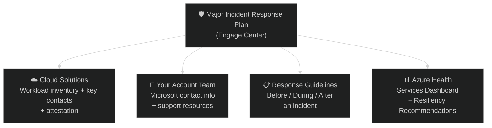

# 04 — Digital MIRP
{: .no_toc }

> 📁 [← Back to Home](/engage-center-notes/)

  
Table of contents

  {: .text-delta }
1. TOC
{:toc}

---

## What Is MIRP?

The **Major Incident Response Plan (MIRP)** is a **digital tool built into Microsoft Engage Center** that helps organisations and Microsoft maintain shared visibility over business-critical cloud solutions, key stakeholder contacts, and incident response procedures — so that when a major service incident occurs, the right people are reached and the right steps are followed quickly.

> MIRP is *not* a reactive incident response service. If you have an active security incident, open a **Severity A support case** or engage the **Microsoft Detection and Response Team (DART)**.

### Why MIRP Matters

Major service incidents demand quick, coordinated action. When teams know what to do, who to call, and where to look, recovery is faster and business impact is reduced. MIRP builds that readiness by:

- **Centralising** business-critical cloud solutions and stakeholder details
- **Defining** clear incident response steps, roles, and cadence
- **Outlining** actions to prepare for, and reduce impact during, service incidents

MIRP is a shared responsibility between the customer and Microsoft — together, it builds trust and enables better outcomes.

### What's New: Why Digital?

MIRP is now fully digital within Engage Center — replacing static PowerPoint decks. The benefits:

| Old approach | Digital MIRP |
|-------------|-------------|
| Static PowerPoint deck | One centralised location in Engage Center |
| Manually shared with contacts | Administrators manage contacts directly |
| No confirmation of accuracy | Attestation confirms information is current |
| Point-in-time snapshot | Updated as the platform and workloads evolve |

---

## MIRP Structure in Engage Center

MIRP is organised into four sections, accessible from the **Major Incident Response Plan** menu in Engage Center:

---

## Cloud Solutions

The **Cloud Solutions** section is the core of MIRP. It is where you maintain the inventory of business-critical workloads and the contacts responsible for them.

### Azure Workloads

Azure workloads are **automatically populated** based on workloads onboarded through the **Proactive Resiliency Program** that are associated with your organisation's active customer agreement.

> 💡 If expected Azure workloads are not visible, they may not meet the onboarding or agreement requirements. Contact your CSAM for assistance.

### M365, D365, and Power Platform Solutions

These are **added manually**. Use the **+ Add** button on the Cloud Solutions page and fill in all required fields.

> Each tenant in the dropdown can be toggled on or off for your workspace. If a tenant needs to be added or removed, follow the instructions in [External Resources](https://aka.ms/ec-externalresources).

### Managing Key Contacts

For each workload or solution, you can add the business and technical contacts who should be reachable during an incident:

1. Select the three vertical dots (⋮) to the right of the workload or solution
2. Select **Add New Contact**
3. Fill out all required fields and select **Add**

> ⚠️ **Microsoft users cannot add contacts** — this must be done by the customer's administrators.

### Removing Non-Critical Workloads

To keep the plan focused, remove workloads that are not business-critical:

1. Select ⋮ next to the workload → **Remove From Plan** → confirm with **Remove**

To add a workload back: **+ Add** → **Link Existing**.

### Attestation

Once the Cloud Solutions section is accurate and complete, select **Confirm** to **attest the MIRP**. Attestation signals to Microsoft that the information is current and the plan is ready for use in an incident.

> 💡 Re-attest whenever your critical workloads or key contacts change — don't wait for an incident to find stale data.

### Printing / Exporting

The Solutions list can be printed or exported as a PDF directly from the portal using the **Print** button.

---

## Your Account Team

The **Your Account Team** section provides always-available support contact information, links to support portals, and other resources needed to reach Microsoft quickly during an incident. This section is maintained by Microsoft and does not require customer input.

---

## Response Guidelines

The **Response Guidelines** section contains comprehensive guidance covering what your team needs to do at each phase of a service incident:

| Phase | Focus |
|-------|-------|
| **Before** a Service Incident | Minimise impact; know how to react when an incident occurs |
| **During** a Service Incident | Know where to get official information; what to do in real time |
| **After** a Service Incident | Understand what happened; prepare better for future incidents |

Use the search bar or the left-side navigation menu within Response Guidelines to find specific topics.

---

## Azure Health

The **Azure Health** section is available to Azure customers and provides two sub-sections:

### Services Dashboard

- View your Azure **subscriptions** and filter by workload
- Check whether **service health alerts** are configured for each subscription
- Follow links to the Azure portal, Azure documentation, or directly create service health alerts

### Resiliency Recommendations

- Review any resiliency details for workloads that have had a review
- Filter by workload
- Follow the link to **Azure Advisor** for full recommendation details

---

## Access & Prerequisites

| Requirement | Detail |
|-------------|--------|
| **Portal access** | Must have a role in Engage Center that grants MIRP access — see [Engage Center Roles](https://learn.microsoft.com/en-us/services-hub/microsoft-engage-center/roles/) |
| **Contract** | Requires an active Microsoft customer agreement with appropriate entitlements — confirm with your CSAM |
| **Admin rights** | Contact management (adding/editing contacts) requires administrator role |
| **Azure workload visibility** | Workloads must be onboarded via the Proactive Resiliency Program |

---

## MIRP vs DART

| Dimension | MIRP | DART |
|-----------|------|------|
| **Type** | Proactive planning & preparedness | Reactive incident response |
| **When** | Before an incident — keep it current | During or immediately after an incident |
| **Nature** | Self-service portal tool in Engage Center | Separate Microsoft IR specialist engagement |
| **Who acts** | Customer administrators + Microsoft account team | DART (Microsoft Detection and Response Team) |
| **Output** | Centralised workload/contact inventory + response guidelines | Incident investigation, containment, remediation |

> 💡 MIRP and DART are complementary. A well-maintained MIRP means that if DART is ever needed, Microsoft already has your critical workloads and the right contacts — response time is faster.

---

## CSA Tips

| Tip | Detail |
|-----|--------|
| **Review MIRP at every QBR** | Check that workloads are current and contacts haven't changed — stale data defeats the purpose |
| **Attestation = readiness signal** | Encourage customers to re-attest after any significant change to their environment or org structure |
| **Azure workload gaps → CSAM** | If the customer's critical Azure workloads aren't showing up, engage the CSAM to resolve the Proactive Resiliency Program onboarding |
| **Walk through Response Guidelines with the customer** | Many customers haven't read them — a 30-minute walkthrough of the Before/During/After guidance is high value |
| **Use MIRP contact inventory as a DRI conversation** | Who's listed as the technical contact for each workload? Is it the right person? This is a good governance touch-point |
| **MIRP before DART, not instead of DART** | For high-risk customers (financial services, healthcare, critical infrastructure), recommend layering a DART retainer on top of a well-maintained MIRP |

---

## Related Resources

| Resource | Link |
|----------|------|
| Official MIRP documentation | [MIRP in Microsoft Engage Center](https://learn.microsoft.com/en-us/services-hub/microsoft-engage-center/customer-health/mirp) |
| Engage Center Roles | [Roles & Access](https://learn.microsoft.com/en-us/services-hub/microsoft-engage-center/roles/) |
| External Resources (tenant management) | [aka.ms/ec-externalresources](https://aka.ms/ec-externalresources) |
| DART | [Microsoft Detection and Response Team](https://www.microsoft.com/en-us/security/blog/2020/06/10/dart-the-microsoft-cybersecurity-team-we-hope-you-never-meet/) |
| Azure Advisor | [Azure Advisor](https://learn.microsoft.com/en-us/azure/advisor/) |

---

## Related Content

- 📄 [03 — Unified & Premier Contracts](/engage-center-notes/03-unified-premier-contracts/) — confirm your contract includes MIRP access
- 🎫 [02 — Support Requests](/engage-center-notes/02-support-requests/) — for active incidents, open a Severity A case
- ⚡ [06 — Cheatsheet](/engage-center-notes/06-cheatsheet/) — MIRP quick reference

---

[← 03 — Unified & Premier Contracts](/engage-center-notes/03-unified-premier-contracts/) | [05 — Services Hub vs Engage Center →](/engage-center-notes/05-services-hub-comparison/)
