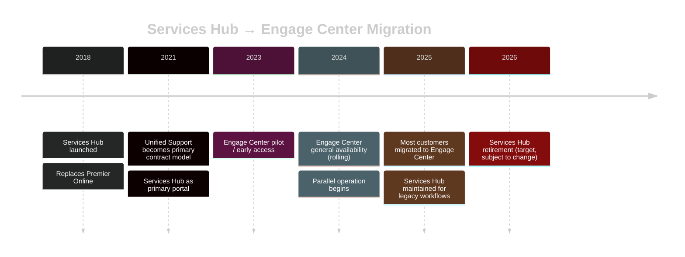
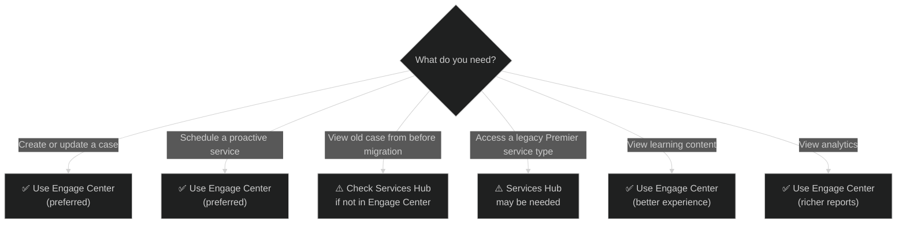

# 05 — Services Hub vs Engage Center
{: .no_toc }

> 📁 [← Back to Home](/engage-center-notes/)

  
Table of contents

  {: .text-delta }
1. TOC
{:toc}

---

## Overview

**Services Hub** (`serviceshub.microsoft.com`) was the primary customer portal for Microsoft Unified (and Premier) support customers from ~2018 onward. **Engage Center** (`engage.microsoft.com`) is its successor, currently rolling out across Microsoft's customer base.

The two portals **run in parallel** during the transition period. Understanding what lives where is essential for CSAs advising customers or using the portals day-to-day.

---

## Migration Timeline

> ⚠️ Dates are indicative. Microsoft has not published a firm Services Hub retirement date. Confirm the current status with your CSAM.

---

## Feature-by-Feature Comparison

### Core Functionality

| Feature | Services Hub | Engage Center | Notes |
|---------|:-----------:|:-------------:|-------|
| **Create support case** | ✅ | ✅ | Both portals submit to same ICM backend |
| **View / update open cases** | ✅ | ✅ | Cases sync between portals |
| **Case history (legacy)** | ✅ Full | ⚠️ Partial | Older cases may not appear in Engage Center |
| **Severity update** | ✅ | ✅ | |
| **Add watchers** | ✅ | ✅ | |
| **File attachments** | ✅ | ✅ | |

### Proactive Services

| Feature | Services Hub | Engage Center | Notes |
|---------|:-----------:|:-------------:|-------|
| **Services catalogue** | ✅ | ✅ Improved | Engage Center has expanded catalogue UI |
| **Schedule a service** | ✅ | ✅ | |
| **On-Demand Assessments** | ✅ | ✅ | Better UI in Engage Center |
| **Service reports / findings** | ✅ | ✅ Improved | Engage Center has richer report viewer |
| **Hours consumption tracking** | ✅ | ✅ | |
| **Custom service requests** | ✅ | ✅ | |

### Account & Contacts

| Feature | Services Hub | Engage Center | Notes |
|---------|:-----------:|:-------------:|-------|
| **View CSAM / TAM** | ✅ | ✅ | |
| **Manage org users** | ✅ | ✅ Improved | Engage Center has better role management |
| **Contract details** | ✅ | ✅ | |
| **Entitlement hours view** | ✅ | ✅ | |

### Learning & Content

| Feature | Services Hub | Engage Center | Notes |
|---------|:-----------:|:-------------:|-------|
| **Learning paths** | ⚠️ Basic | ✅ Full | Engage Center has deeper Microsoft Learn integration |
| **Events calendar** | ⚠️ Basic | ✅ | |
| **Content library** | ✅ | ✅ | |
| **Role-based recommendations** | ❌ | ✅ | New in Engage Center |

### Analytics & Reporting

| Feature | Services Hub | Engage Center | Notes |
|---------|:-----------:|:-------------:|-------|
| **Case volume reports** | ✅ | ✅ Improved | More visualisation options in Engage Center |
| **Resolution time analytics** | ⚠️ Basic | ✅ | |
| **Service consumption reports** | ✅ | ✅ | |
| **Export to CSV/PDF** | ✅ | ✅ | |
| **Health score** | ❌ | ✅ | New capability in Engage Center |

### Technical & Integration

| Feature | Services Hub | Engage Center | Notes |
|---------|:-----------:|:-------------:|-------|
| **Mobile responsive** | ⚠️ Partial | ✅ | Engage Center better on mobile |
| **Accessibility (WCAG)** | ⚠️ | ✅ Improved | |
| **API access** | ❌ | ❌ | Neither portal offers a public API yet |
| **SSO / Entra ID** | ✅ | ✅ | |
| **Multi-tenant support** | ✅ | ✅ | |

---

## What's Better in Engage Center

| Improvement | Detail |
|-------------|--------|
| **Modern UI/UX** | Fluent Design System, consistent with M365 Admin Center and Azure Portal |
| **Learning integration** | Deep Microsoft Learn integration with role-based recommendations |
| **Analytics depth** | Richer case and service analytics with better visualisation |
| **Health score** | New composite environment health indicator |
| **User management** | Better role-based access control for org users |
| **Services catalogue** | Cleaner browsing and scheduling experience |
| **Report viewer** | Better in-portal viewing of proactive service findings |
| **Search** | Global search across cases, services, and learning content |

---

## What's Still Only in Services Hub (as of 2025)

| Feature | Detail |
|---------|--------|
| **Some legacy proactive service types** | Certain older PFE-style engagements not yet migrated |
| **Historical case data (pre-migration)** | Cases from before your migration date may only be fully visible in Services Hub |
| **Some Premier-specific workflows** | Legacy Premier customers may still need Services Hub for certain contract operations |

> 💡 If a customer says "I can't find X in Engage Center", always check Services Hub as a fallback during the transition period.

---

## Decision: Which Portal to Use?

**Default recommendation for CSAs:** Always start in **Engage Center**. Fall back to **Services Hub** only when the specific feature or data is confirmed missing.

---

## URL & Access Reference

| Portal | URL | Primary Use (2025) |
|--------|-----|-------------------|
| **Engage Center** | `engage.microsoft.com` | Primary portal for most workflows |
| **Services Hub** | `serviceshub.microsoft.com` | Legacy / fallback |
| **Azure Portal** | `portal.azure.com` | Azure resource management; can raise Azure support cases here too |
| **M365 Admin Center** | `admin.microsoft.com` | M365/O365 admin; can raise M365 support cases |
| **Microsoft Support** | `support.microsoft.com` | Consumer/SMB support; also self-serve KB |

---

## Advising Customers on the Transition

### Common Customer Concerns

| Concern | Response |
|---------|----------|
| "Will I lose my case history?" | Cases are synced to Engage Center, but historical data before your migration date may require Services Hub as a reference. Microsoft retains all case data. |
| "My team is used to Services Hub — why change?" | Engage Center offers better UX, richer analytics, and deeper learning integration. Services Hub is still available in parallel — no forced cutover yet. |
| "I can't find the service I was using in Services Hub" | Some legacy service types are still being migrated. Contact your CSAM to schedule those services — they can bypass the portal if needed. |
| "Our contract renews next month — should we wait?" | No — Engage Center access is based on your contract, not a separate sign-up. |

### Transition Checklist for CSAs

| Task | Done? |
|------|-------|
| Confirm customer has Engage Center access provisioned | ☐ |
| Walk through key sections in Engage Center with customer | ☐ |
| Verify open cases appear correctly in Engage Center | ☐ |
| Check if any active services are still only in Services Hub | ☐ |
| Update bookmarks / shared links to point to Engage Center | ☐ |
| Confirm CSAM contact details are current in People section | ☐ |

---

## Related

- 🌐 [00 — Platform Overview](./00-overview/) — Engage Center context
- 🧭 [01 — Navigation & Features](./01-navigation-features/) — Engage Center UI walkthrough
- ⚡ [06 — Cheatsheet](./06-cheatsheet/) — quick URL and feature reference
