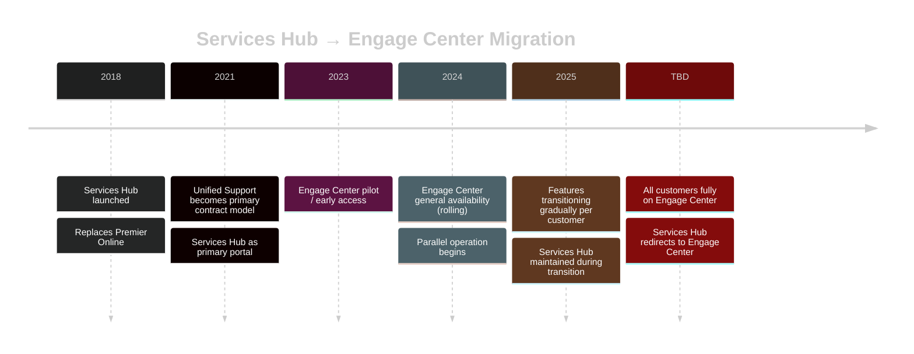
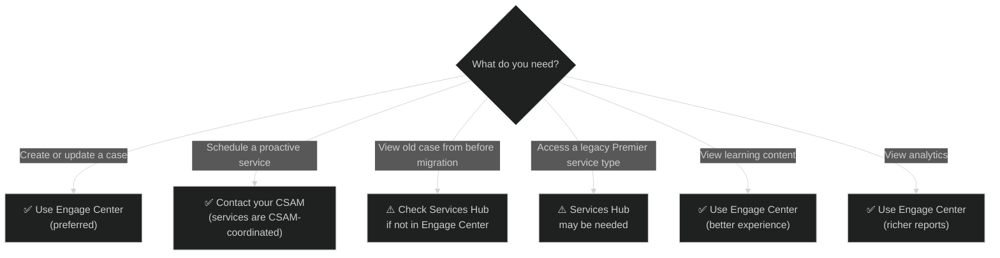

# 05 — Services Hub vs Engage Center
{: .no_toc }

> 📁 [← Back to Home](/engage-center-notes/)

  
Table of contents

  {: .text-delta }
1. TOC
{:toc}

---

## Overview

**Services Hub** (`serviceshub.microsoft.com`) was the primary customer portal for Microsoft Unified (and Premier) support customers from ~2018 onward. **Engage Center** (`engagecenter.microsoft.com`) is its successor — built on Azure — currently rolling out across Microsoft's customer base.

The two portals **run in parallel** during the transition period. The outcome is defined: **Engage Center becomes the single experience for daily support work**, with Services Hub eventually redirecting to it. Understanding what lives where during the transition is essential for CSAs advising customers.

---

## Migration Timeline

> ⚠️ Microsoft has not published a firm Services Hub retirement date. The docs state there is "a defined point where all customers move fully to Engage Center, and Services Hub is no longer accessed" — but no year is given. Confirm the current status with your CSAM.

---

## Official Rollout Phases

Microsoft transitions features to Engage Center in a defined order. A customer's experience may be gradual (features appear over time) or faster-paced (multiple features shift within days). The official phase order is:

| Phase | Features Transitioning |
|-------|----------------------|
| **1 — Support foundations** | Case Create, Support Management |
| **2 — Everyday support context** | External Resources, Digital MIRP, Learning, Support Insights |
| **3 — Collaboration & artifacts** | Shared Files |
| **4 — Administration & structure** | User Management, Space Management |
| **5 — Organisation & communications** | Customer Level Workspace, Newsletter, Customer Activity |
| **6 — On-Demand Assessments** | Assessments (last to transition) |

> 💡 Single Workspace customers generally receive features before Multiple Workspace customers. A feature is fully transitioned when it is end-to-end usable in Engage Center **and** no longer available in Services Hub (which redirects instead).

---

## Feature-by-Feature Comparison

### Core Functionality

| Feature | Services Hub | Engage Center | Notes |
|---------|:-----------:|:-------------:|-------|
| **Create support case** | ✅ | ✅ | Both portals submit to same ICM backend |
| **View / update open cases** | ✅ | ✅ | Cases sync between portals |
| **Case history (legacy)** | ✅ Full | ⚠️ Partial | Older cases may not appear in Engage Center |
| **Severity update** | ✅ | ✅ | |
| **Add watchers** | ✅ | ✅ | |
| **File attachments** | ✅ | ✅ | |

### Proactive Services

| Feature | Services Hub | Engage Center | Notes |
|---------|:-----------:|:-------------:|-------|
| **Services catalogue** | ✅ | ⚠️ CSAM-coordinated | Proactive services are scheduled through your CSAM, not a self-service catalogue |
| **Schedule a service** | ✅ | ⚠️ Via CSAM | Contact your CSAM to schedule proactive services |
| **On-Demand Assessments** | ✅ | ✅ | Last feature to transition (Phase 6) |
| **Service reports / findings** | ✅ | ✅ Improved | Engage Center has richer report viewer |
| **Hours consumption tracking** | ✅ | ✅ | |
| **Digital MIRP** | ⚠️ Limited | ✅ Full | Fully digital in Engage Center (Phase 2) |
| **External Resources** | ❌ | ✅ | New in Engage Center (Phase 2) |
| **Shared Files** | ⚠️ | ✅ | Account team document sharing (Phase 3) |

### Account & Contacts

| Feature | Services Hub | Engage Center | Notes |
|---------|:-----------:|:-------------:|-------|
| **View CSAM / TAM** | ✅ | ✅ | |
| **Manage org users** | ✅ | ✅ Improved | Engage Center has better role management |
| **Contract details** | ✅ | ✅ | |
| **Entitlement hours view** | ✅ | ✅ | |

### Learning & Content

| Feature | Services Hub | Engage Center | Notes |
|---------|:-----------:|:-------------:|-------|
| **Learning paths / On-Demand Learning** | ⚠️ Basic | ✅ Full | Includes Microsoft Learn modules, learning paths, and hands-on labs; progress tracked |
| **Scheduled Services (instructor-led)** | ❌ | ✅ | Browse and register for instructor-led sessions directly — new in Engage Center |
| **My Learning** | ❌ | ✅ | Personalised progress view: Not Started / In Progress / Completed; assigned learning |
| **Learning Management** | ❌ | ✅ | Assign learning to teams, set due dates, track completion — requires Learning Manager role |
| **Content library** | ✅ | ✅ | |

### Support Insights & Reporting

| Feature | Services Hub | Engage Center | Notes |
|---------|:-----------:|:-------------:|-------|
| **Case volume trend** | ✅ | ✅ Improved | More visualisation options; 18 months of data |
| **Initial Response (IR) Met %** | ⚠️ Basic | ✅ | Tracks SLA compliance over time |
| **CritSit tracking** | ⚠️ Basic | ✅ | Sev A count + elapsed critical minutes |
| **Cross-cloud case distribution** | ❌ | ✅ | Azure + M365 + other products in one view |
| **Open cases by severity & age** | ✅ | ✅ Improved | |
| **Export to CSV/PDF** | ✅ | ✅ | |

### Technical & Integration

| Feature | Services Hub | Engage Center | Notes |
|---------|:-----------:|:-------------:|-------|
| **Mobile responsive** | ⚠️ Partial | ✅ | Engage Center better on mobile |
| **Accessibility (WCAG)** | ⚠️ | ✅ Improved | |
| **API access** | ❌ | ❌ | Neither portal offers a public API yet |
| **SSO / Entra ID** | ✅ | ✅ | |
| **Multi-tenant support** | ✅ | ✅ | |

---

## What's Better in Engage Center

| Improvement | Detail |
|-------------|--------|
| **Modern UI/UX** | Built on Azure; Fluent Design System, consistent with M365 Admin Center and Azure Portal |
| **Learning integration** | Unified learning experience: On-Demand Learning, Scheduled Services (instructor-led), My Learning progress tracking, and Learning Management for teams |
| **Support Insights** | 6 months of cross-cloud data; IR Met %, CritSit tracking, case distribution by product |
| **Digital MIRP** | Fully digital, self-service; replaces static PowerPoint decks |
| **External Resources** | Centralised management of external tenant links and resources |
| **User management** | Microsoft Entra group-based role management with granular permissions |
| **Customer Activity** | Centralised view of contract details, entitlement hours, and purchased services |
| **Report viewer** | Better in-portal viewing of proactive service findings |
| **Shared Files** | Account team can upload documents directly into the portal |

---

## What's Still Transitioning (as of 2025)

Based on the official rollout order, features later in the phase sequence may still be in Services Hub for some customers:

| Feature | Rollout Phase | Status |
|---------|:------------:|--------|
| **On-Demand Assessments** | Phase 6 (last) | May still be in Services Hub |
| **Space Management** | Phase 4 | May still be in Services Hub |
| **Newsletter & Customer Activity** | Phase 5 | May still be in Services Hub |
| **Customer Level Workspace** | Phase 5 | May still be in Services Hub |
| **Historical case data (pre-migration)** | N/A | Older cases may only be fully visible in Services Hub |

> ⚠️ Feature availability varies by customer — some transition faster than others. When a feature has fully transitioned, Services Hub will **redirect** you to Engage Center rather than showing the feature there.

> 💡 If a customer says "I can't find X in Engage Center", check what phase that feature is in and whether Services Hub still shows it.

---

## Decision: Which Portal to Use?

**Default recommendation for CSAs:** Always start in **Engage Center**. Fall back to **Services Hub** only when the specific feature or data is confirmed missing.

---

## URL & Access Reference

| Portal | URL | Primary Use (2025) |
|--------|-----|-------------------|
| **Engage Center** | `engagecenter.microsoft.com` | Primary portal for most workflows |
| **Services Hub** | `serviceshub.microsoft.com` | Legacy / fallback |
| **Azure Portal** | `portal.azure.com` | Azure resource management; can raise Azure support cases here too |
| **M365 Admin Center** | `admin.microsoft.com` | M365/O365 admin; can raise M365 support cases |
| **Microsoft Support** | `support.microsoft.com` | Consumer/SMB support; also self-serve KB |

---

## Advising Customers on the Transition

### Common Customer Concerns

| Concern | Response |
|---------|----------|
| "Will I lose my case history?" | Cases are synced to Engage Center, but historical data before your migration date may require Services Hub as a reference. Microsoft retains all case data. |
| "My team is used to Services Hub — why change?" | Engage Center offers better UX, richer analytics, and deeper learning integration. Services Hub is still available in parallel — no forced cutover yet. |
| "I can't find the service I was using in Services Hub" | Some legacy service types are still being migrated. Contact your CSAM to schedule those services — they can bypass the portal if needed. |
| "Our contract renews next month — should we wait?" | No — Engage Center access is based on your contract, not a separate sign-up. |

### Transition Checklist for CSAs

| Task | Done? |
|------|-------|
| Confirm customer has Engage Center access provisioned | ☐ |
| Verify Engage Center URL is allowlisted on customer firewall / proxy | ☐ |
| Confirm Conditional Access policies permit access to Engage Center | ☐ |
| Walk through key sections in Engage Center with customer | ☐ |
| Verify open cases appear correctly in Engage Center | ☐ |
| Check which rollout phase the customer is on; identify features still in Services Hub | ☐ |
| Work with CSAM to remove unused Services Hub Workspaces | ☐ |
| Update bookmarks / shared links to point to Engage Center | ☐ |

---

## Official Resources

| Resource | Link |
|----------|------|
| Get ready for Engage Center | [Migration guide](https://learn.microsoft.com/en-us/services-hub/microsoft-engage-center/get-started/migration) |
| What to expect during rollout | [Rollout phases](https://learn.microsoft.com/en-us/services-hub/microsoft-engage-center/get-started/what-to-expect) |
| Engage Center features overview | [Features](https://learn.microsoft.com/en-us/services-hub/microsoft-engage-center/get-started/features) |
| Connectivity / allowlist guide | [Engage Center connectivity](https://learn.microsoft.com/en-us/services-hub/microsoft-engage-center/support/engage-center-connectivity) |

---

## Related Content

- 🌐 [00 — Platform Overview](/engage-center-notes/00-overview/) — Engage Center context
- 🧭 [01 — Navigation & Features](/engage-center-notes/01-navigation-features/) — Engage Center UI walkthrough
- ⚡ [06 — Cheatsheet](/engage-center-notes/06-cheatsheet/) — quick URL and feature reference

---

[← 04 — Digital MIRP](/engage-center-notes/04-digital-mirp/) | [06 — Quick Reference Cheatsheet →](/engage-center-notes/06-cheatsheet/)
