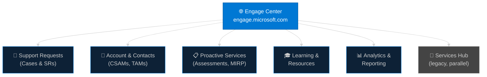
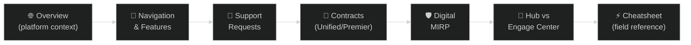

# 🌐 Microsoft Engage Center — CSA Reference Notes
{: .no_toc }

**Cloud Solutions Architect Field Reference**
{: .fs-5 .fw-300 }

[Get Started →](/engage-center-notes/00-overview){: .btn .btn-primary .fs-5 .mb-4 .mb-md-0 .mr-2 }
[View on GitHub](https://github.com/marcogrimaldi29/engage-center-notes){: .btn .fs-5 .mb-4 .mb-md-0 target="_blank" }

---

> 🏠 Maintained by **[Marco Grimaldi](https://www.linkedin.com/in/marco-grimaldi29/)** — Cloud Solutions Architect.
> Based on the **[official Microsoft Engage Center documentation](https://learn.microsoft.com/en-us/microsoft-365/admin/misc/engage-center)** and first-hand experience with the platform.
> Find more notes and content at **[🌐 marcogrimaldi29.com](https://marcogrimaldi29.com)**.
> *Not affiliated with or endorsed by Microsoft. Always verify against the latest documentation.*

---

## 📌 What Is Engage Center?

**Engage Center** is Microsoft's next-generation customer experience portal — the unified hub for customers with **Unified Support** (formerly Premier) contracts. It consolidates support case management, proactive services, account information, and learning resources into a single, modernised interface.

> **Key URL:** [engage.microsoft.com](https://engage.microsoft.com)

Engage Center is rolling out progressively across Microsoft's customer base and is replacing/supplementing **Services Hub** (`serviceshub.microsoft.com`). New capabilities are being added continuously.

---

## 🗺️ Platform Architecture

---

## 🗂️ Notes Index

<h3 style="margin-top:0;">🌐 00 — Platform Overview</h3>

What Engage Center is, the rollout context, key personas, and how it fits within Microsoft's support ecosystem.

<a href="./00-overview/" class="btn btn-outline fs-5">Read →</a>

<h3 style="margin-top:0;">🧭 01 — Navigation & Features</h3>

UI walkthrough, key sections, search, notifications, account settings, and productivity tips.

<a href="./01-navigation-features/" class="btn btn-outline fs-5">Read →</a>

<h3 style="margin-top:0;">🎫 02 — Support Requests</h3>

Creating, managing, and escalating support cases. SLA tiers, severity levels, and routing logic.

<a href="./02-support-requests/" class="btn btn-outline fs-5">Read →</a>

<h3 style="margin-top:0;">📄 03 — Unified & Premier Contracts</h3>

Unified Core / Advanced / Performance tiers vs legacy Premier. Benefits, SLAs, and entitlements explained.

<a href="./03-unified-premier-contracts/" class="btn btn-outline fs-5">Read →</a>

<h3 style="margin-top:0;">🛡️ 04 — Digital MIRP</h3>

Digital delivery of the Microsoft Incident Response Planning service — scope, deliverables, and how to engage.

<a href="./04-digital-mirp/" class="btn btn-outline fs-5">Read →</a>

<h3 style="margin-top:0;">🔄 05 — Services Hub vs Engage Center</h3>

Side-by-side feature comparison, migration path, what's changed, and what's still in Services Hub.

<a href="./05-services-hub-comparison/" class="btn btn-outline fs-5">Read →</a>

<h3 style="margin-top:0;">⚡ 06 — Quick Reference Cheatsheet</h3>

Key URLs, SLA tables, contract tier comparison at a glance, escalation paths, and CSA field tips.

<a href="./06-cheatsheet/" class="btn btn-outline fs-5">Read →</a>

---

## 🧭 Navigation Flow

---

## 📄 Official Resources

| Resource | Link |
|----------|------|
| 🌐 Engage Center Portal | [engage.microsoft.com](https://engage.microsoft.com) |
| 🏛️ Services Hub (legacy) | [serviceshub.microsoft.com](https://serviceshub.microsoft.com) |
| 📘 Microsoft Unified Support | [Microsoft Unified Support](https://www.microsoft.com/en-us/unifiedsupport) |
| 🎓 Microsoft Learn — Support | [Microsoft Support Documentation](https://learn.microsoft.com/en-us/microsoft-365/admin/misc/engage-center) |
| 📞 Microsoft Support | [support.microsoft.com](https://support.microsoft.com) |

---

## ✍️ About the Author

Maintained by **[Marco Grimaldi](https://www.linkedin.com/in/marco-grimaldi29/)** — Cloud Solutions Architect.

📍 **Find more content at [🌐 marcogrimaldi29.com](https://marcogrimaldi29.com)**

> These notes reflect hands-on experience working with Engage Center in a CSA capacity. Content is updated as the platform evolves. Always cross-check with the latest Microsoft documentation.

---

## 📈 Analytics

This site uses **[Umami](https://umami.is/)** for privacy-friendly analytics.

---

## ©️ Credits & Acknowledgements

The **[Just the Docs](https://github.com/just-the-docs/just-the-docs)** theme is used for a clean, documentation-style layout. Licensed under [MIT](https://opensource.org/license/MIT).

Created with the help of AI. Model used: **[Claude Sonnet 4.6](https://www.anthropic.com/news/claude-sonnet-4-6)**. The content has been reviewed and edited by the author for accuracy and clarity, but may contain errors. Always verify against the latest [Microsoft documentation](https://learn.microsoft.com/en-us/).

> *Not affiliated with or endorsed by Microsoft.*
